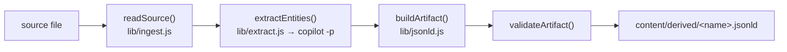

`derive` turns **unstructured / semi-structured** sources — `.docx`, prose
Markdown, and loosely-structured text — into committed `*.jsonld` entity
artifacts. It is **Feature F8** (issue [#18](issue-18),
[PR #27](https://github.com/anokye-labs/kbexplorer-cli/pull/27)) and mirrors
[generate](cmd-generate): a fuzzy phase via the
[programmatic-mode runtime](derivation-runtime) extracts entities, then a
deterministic phase normalizes and validates them into canonical JSON-LD that
satisfies the [node-type contract](node-type-contract).

```bash
# Read .docx/.md/.txt, extract via `copilot -p`, emit content/derived/*.jsonld
npx kbexplorer derive docs/org-chart.docx notes/teams.md

# Runnable in THIS repo — re-emits content/derived/platform-squad.jsonld
npx kbexplorer derive docs/samples/platform-squad.md

# Preview the exact copilot command + planned outputs; run nothing
npx kbexplorer derive docs/samples/platform-squad.md --dry-run

# CI drift gate: non-zero exit if any committed artifact is stale (no LLM call)
npx kbexplorer derive docs/samples/platform-squad.md --check
```

## Pipeline



1. **Ingest** — `readSource` (`src/lib/ingest.js`) classifies the extension,
   reads bytes, and normalizes to a `{ path, format, title, text, sha256, … }`
   document. `.docx` is unzipped in-process by `src/lib/docx.js` (no deps).
2. **Extract** — `extractEntities` (`src/lib/extract.js`) prompts the model for
   one strict JSON object of `{ entities, relationships }` and parses it
   tolerantly (fences / stray prose are stripped).
3. **Emit** — `buildArtifact` + `canonicalStringify` (`src/lib/jsonld.js`) map
   the intermediate onto the contract and serialize with **sorted keys, no
   timestamps**. `validateArtifact` fails the run if anything is off-contract.

## Options

| Flag | Effect |
|---|---|
| `-o, --out <dir>` | Output directory (default `content/derived`). |
| `--check` | Read-only drift gate; never writes, never calls the LLM. |
| `--refresh`, `--force` | Re-run fuzzy extraction even if a fresh artifact exists. |
| `--allow-tool <spec>` | Scoped permission (repeatable); opts out of allow-all. |
| `--allow-all-tools` | Default posture for extraction. |
| `--dry-run` | Print the assembled `copilot` command + planned outputs. |

## Idempotency & drift

Each artifact embeds its extraction intermediate keyed by the source's
SHA-256. Re-running `derive` on an **unchanged** source reuses that embedded
intermediate and re-emits deterministically — **without calling the LLM** — so
output is byte-identical. `--check` reports drift (and exits non-zero) when an
artifact is missing, when its source changed, or when a fresh deterministic
emit differs from the committed bytes. Like [audit](cmd-audit), it is safe to
wire into CI; unlike audit it targets derived data rather than authored pages.

```bash
npx kbexplorer derive docs/*.docx        # extract once, commit the *.jsonld
npx kbexplorer derive docs/*.docx --check   # CI: re-read the sources; stays green until one changes
```

The fuzzy phase needs the [Copilot CLI](https://docs.github.com/copilot/how-tos/copilot-cli)
on `PATH` (or `KBEXPLORER_COPILOT_BIN`); already-derived sources with unchanged
input do not. See [node-type-contract](node-type-contract) for the exact shape
of an emitted artifact and how the engine renders it.

<!-- Sources: src/commands/derive.js, src/lib/ingest.js, src/lib/docx.js, src/lib/extract.js, src/lib/jsonld.js -->
