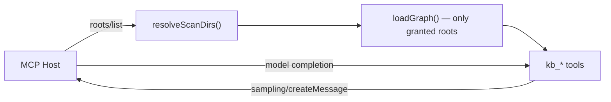
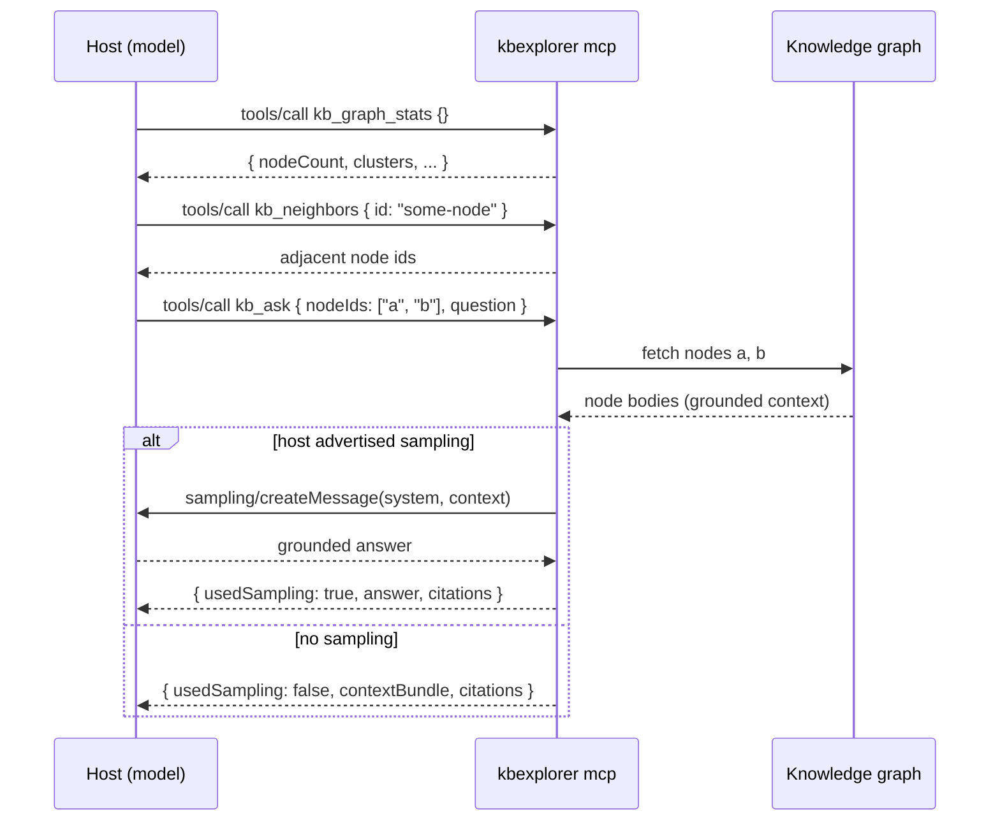

`mcp` starts a **Model Context Protocol server** over stdio that exposes this
repository's authored knowledge graph (`content/*.md`) to any MCP host — Copilot,
Claude Desktop, or a custom client. It answers work_iq / web_iq-style intelligence
questions about the repo, but **scoped to the graph the host grants it** and
**grounded** so answers cite real nodes.

```bash
npx kbexplorer mcp                       # serve over stdio (host provides roots)
npx kbexplorer mcp --root ./content      # add an explicit root (supplements host roots)
npx kbexplorer mcp --no-sampling         # never call the host model; always return the bundle
```

It is a server, not a one-shot command — it speaks JSON-RPC on stdin/stdout and
runs until the host disconnects. Wire it into a host with a few lines:

```json
{ "mcpServers": { "kbexplorer": { "command": "node", "args": ["bin/cli.js", "mcp"] } } }
```

## Tools

| Tool | Purpose |
|---|---|
| `kb_ask` | Ground a question in explicit node ids and answer via host **sampling**; degrades to a grounded context bundle when sampling is unavailable |
| `kb_get_node` | Fetch one node (frontmatter + full body) by `id` |
| `kb_neighbors` | Breadth-first neighbours up to `depth` (clamped 1–4) |
| `kb_graph_stats` | Node/edge/cluster counts, orphans, and the active roots |

## Two host capabilities do the work

The server is deliberately credential-free and context-minimal. It borrows
**both** of the capabilities the original design called for from the host:

- **roots** — the host tells the server which directories it may read. The graph
  loader scans only those roots (each root's `content/` subdir, or the root
  itself if it holds `.md`), so the server never shares more of the workspace
  than it was granted. When the host sends `roots/list_changed`, the cached graph
  is invalidated and re-scoped on the next call.
- **sampling** — for `kb_ask`, the server builds a grounded context bundle from
  the caller-supplied node ids, then asks the **host's own model** to answer via
  `sampling/createMessage`. No API key lives in the server; the host owns the
  model and the user's consent.



### kb_ask round-trip

The host model navigates the graph first, then asks `kb_ask` with explicit
node ids:



That degradation path is not theoretical: a non-interactive `copilot -p` run
against GitHub Copilot CLI 1.0.64 connects, lists tools, and retrieves context,
but its scripting path does **not** advertise MCP sampling — so `kb_ask` returns
the grounded bundle with citations instead of a synthesised answer. Copilot CLI
*does* support sampling in **interactive** sessions (gated by a user-approval
prompt), and any host that advertises sampling gets the full `usedSampling: true`
answer. Both paths are covered by tests, and
`scripts/mcp-sampling-bridge.mjs` proves the sampling path end-to-end against a
real model.

## A dependency-philosophy exemplar

`mcp` is the first feature built **after** the [zero-dependency posture was
retired](zero-deps). Rather than hand-roll a JSON-RPC/MCP stack, it sits on the
official `@modelcontextprotocol/sdk` (`McpServer` + `StdioServerTransport`) with
`zod` for input validation — a deliberate, vetted dependency that the project now
prefers over a bespoke protocol implementation.

<!-- Sources: src/commands/mcp.js, src/lib/graph.js, scripts/mcp-sampling-bridge.mjs, docs/mcp-server.md -->
