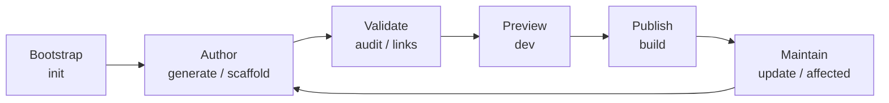

Eleven verbs cover the full kbexplorer lifecycle. Each one is a thin orchestration
module in `src/commands/`; the heavy lifting lives in [`src/lib/`](libs-overview).

## Lifecycle phases



<!-- Sources: src/commands/*.js -->

## audit vs links

`audit` and `links` are deliberately non-overlapping. [audit](cmd-audit)
reports **hard structural errors** (duplicate ids, broken parents, parent
cycles, dead connections, missing required fields) and exits non-zero — safe
to wire into CI. [links](cmd-links) reports **soft graph health** (orphans,
weak clusters, coverage gaps, unlinkified mentions) and is advisory only.

## Composition example

A realistic CI block:

```bash
npx kbexplorer audit           # fail on any structural error
npx kbexplorer links           # warn on graph health
npx kbexplorer build           # produce dist/
```

A realistic refresh loop after a code change:

```bash
npx kbexplorer affected HEAD~5     # which nodes cite the changed files?
# edit those nodes
npx kbexplorer audit               # validate
npx kbexplorer dev                 # preview
```

<!-- Sources: src/commands/audit.js, src/commands/links.js, src/commands/affected.js -->
