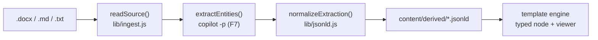

kbexplorer-cli is **Epic 2's content-derivation half** of the system. Where
[generate](cmd-generate) authors the *wiki you are reading*, the **derivation
subsystem** turns unstructured org knowledge — `.docx`, prose Markdown, plain
text — into typed graph entities that the **template engine** (Epic 1) renders.
The two repos read as one system: `derive` emits engine-contract JSON-LD, and
the engine ingests it as typed nodes.

## The whole pipeline at a glance

1. **Ingest (deterministic).** `src/lib/ingest.js` reads bytes into a normalized
   document — including a built-ins-only `.docx` unzip + WordprocessingML-to-text
   reducer (`src/lib/docx.js`).
2. **Extract (fuzzy).** The text is sent to GitHub Copilot through the
   [programmatic-mode runtime](derivation-runtime) (`copilot -p`), which returns
   a strict `{ entities, relationships }` intermediate.
3. **Emit (deterministic + canonical).** `lib/jsonld.js` normalizes that
   intermediate into committed `*.jsonld` that satisfies the
   [node-type contract](node-type-contract) — sorted keys, no timestamps, so
   identical input yields byte-identical output.

## Two features, one substrate

| Feature | PR | What it added |
|---|---|---|
| **F7** ([#17](issue-17)) | [#26](https://github.com/anokye-labs/kbexplorer-cli/pull/26) | The Copilot programmatic-mode [runtime](derivation-runtime) — `copilot -p`, scoped allowlists, deterministic-vs-fuzzy routing. |
| **F8** ([#18](issue-18)) | [#27](https://github.com/anokye-labs/kbexplorer-cli/pull/27) | The build-time [derive](cmd-derive) pipeline: docx/prose → committed `*.jsonld` conforming to the [contract](node-type-contract). |

`derive` does not re-shell out to `copilot`; it calls the same `runCopilot()`
adapter that [generate](cmd-generate) uses, via the shared **runtime router**.

## Why it matters

A reader can follow a single thread end to end: a sentence in a `.docx`
(*"Jane Doe leads the Platform Squad"*) becomes a committed
`kg://person/jane-doe` node and a `leads` edge in a `*.jsonld` file, which the
engine renders through its `PersonView` / `SquadView` — no schema migration, no
core edits. See [node-type-contract](node-type-contract) for the rendered worked
example.

<!-- Sources: src/commands/derive.js, src/lib/ingest.js, src/lib/extract.js, src/lib/jsonld.js, src/lib/copilot-runtime.js -->
