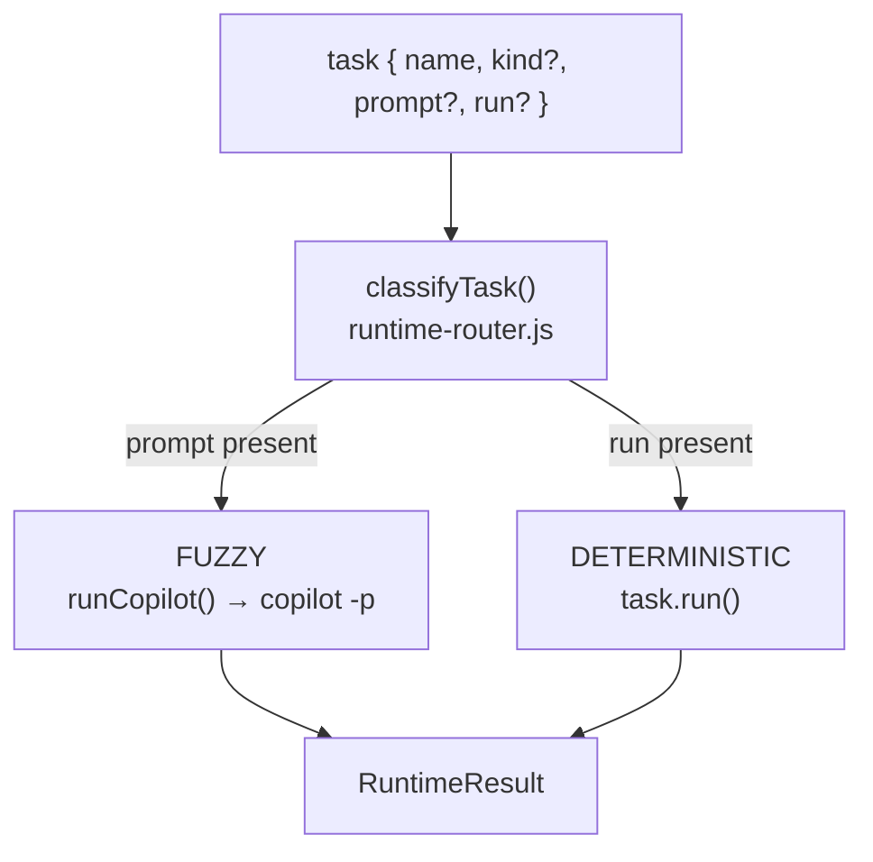

The runtime substrate introduced by **Feature F7** (issue [#17](issue-17),
[PR #26](https://github.com/anokye-labs/kbexplorer-cli/pull/26)). It runs
**fuzzy** (LLM / agentic) work through GitHub Copilot CLI's non-interactive mode
— `copilot -p "<prompt>"` — and **deterministic** work through pure in-process
computation. A small **router** sends each task to the right place so callers
get consistent behavior regardless of task type. Full API reference lives in
[`docs/copilot-runtime.md`](https://github.com/anokye-labs/kbexplorer-cli/blob/main/docs/copilot-runtime.md).

## Deterministic vs. fuzzy routing



`classifyTask` in `src/lib/runtime-router.js` decides a task's kind by
precedence: an explicit `kind` wins, else a `prompt` ⇒ **fuzzy**, else a `run`
⇒ **deterministic**, else deterministic. `routeTask` logs the decision
(`[router] <name> → <kind>`) and `routeTasks` runs a pipeline in order. The
fuzzy branch is injected as `runFuzzy` (normally wrapping `runCopilot`), which
keeps the whole path **hermetically testable** with no live LLM.

## `runCopilot()` — the adapter

`src/lib/copilot-runtime.js` is a built-ins-only ESM adapter that spawns
`copilot -p`, captures output, and returns a structured `RuntimeResult`
(`{ ok, exitCode, response, events, durationMs, … }`). It rejects with a
`CopilotRuntimeError` carrying a `.code` from `RuntimeErrorCode`
(`BINARY_MISSING`, `TIMEOUT`, `NONZERO_EXIT`, …) so callers can react precisely. `buildCopilotArgs()` is the
pure argv assembler underneath — deterministic, so it is unit-tested directly.

```js
const res = await runCopilot({
  prompt: 'Summarize package.json as JSON-LD',
  allowTools: ['view', 'shell(git)'],   // OR allowAllTools: true
  outputFormat: 'json',                  // parse JSONL into res.events
  timeoutMs: 120_000,
});
```

## Scoped allowlists

Non-interactive runs must auto-approve tools. Two postures, mutually exclusive:

| Posture | Flag | When |
|---|---|---|
| **Allow-all** | `--allow-all-tools` | Trusted local analysis of your own repo (the default for [generate](cmd-generate) and [derive](cmd-derive)). |
| **Scoped** | `--allow-tool '<spec>'` (repeatable) | Least-privilege: e.g. `--allow-tool 'shell(git)' --allow-tool 'write'`. Supplying **any** `--allow-tool` opts out of the implicit allow-all. |

That opt-out rule is enforced in code — see `buildDeriveRuntimeOptions` in
`src/commands/derive.js`: a non-empty `allowTools` sets `allowAllTools: false`.

## Stage mapping

Both content-producing commands map cleanly onto the substrate:

| Command | Fuzzy stage (`copilot -p`) | Deterministic stage |
|---|---|---|
| [generate](cmd-generate) | kb-architect analyzes the repo → `catalogue.json` | `transformCatalogue` → `content/*.md` + manifest |
| [derive](cmd-derive) | `extractEntities` → `{ entities, relationships }` | `normalizeExtraction` → committed `*.jsonld` |

The binary is resolved as explicit `binary` → `KBEXPLORER_COPILOT_BIN` env →
`copilot` on `PATH`; `isCopilotAvailable()` lets a command verify presence
before promising a fuzzy run.

<!-- Sources: src/lib/copilot-runtime.js, src/lib/runtime-router.js, src/commands/derive.js, docs/copilot-runtime.md -->
