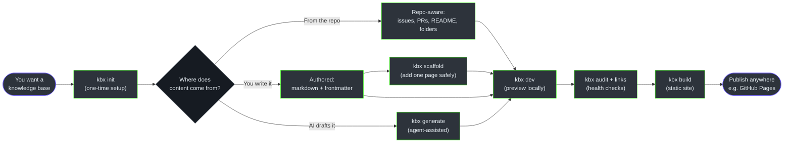
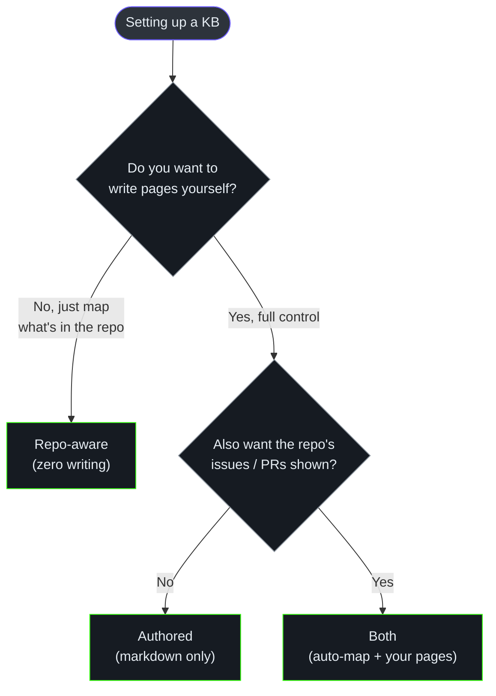
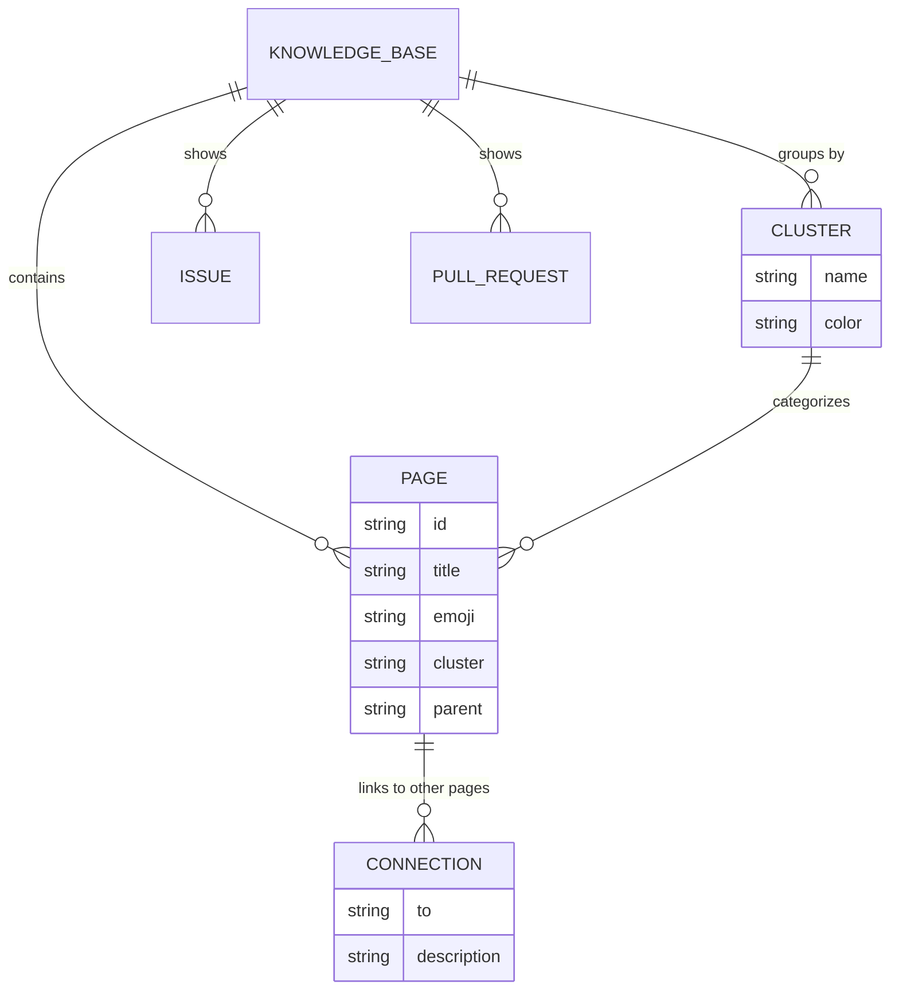

# Knowledge Base Author Guide — kbexplorer-cli

**Audience:** the person who **uses** kbx to build a knowledge base over a repository (or
a folder of markdown). You're comfortable running a command in a terminal, but you are *not*
here to modify the CLI's source — you want to turn your content into a navigable, explorable
graph and publish it. (If you want to hack on the CLI itself, read the
[Contributor Guide](./contributor-guide.md); if you're standardizing kbx across a whole
org, read the [Platform & Template Author Guide](./platform-guide.md).)

Every claim links to source on `main` so you can verify behavior.

---

## 1. What you can build

kbx turns a content store — a GitHub repo, or a directory of markdown — into an
**interactive knowledge graph**: a constellation of clickable cards and a force-directed network
you can explore, search, and read, instead of a flat wiki. You run one setup command, choose
where the content comes from, preview it locally, and publish it as a static website you host
wherever you like ([`README.md`](https://github.com/anokye-labs/kbexplorer-cli/blob/main/README.md), [`SKILL.md`](https://github.com/anokye-labs/kbexplorer-cli/blob/main/src/assets/skills/kbx/SKILL.md)).

Because the graph is regenerated from the *live* repo each time you preview or build, it
reflects what's actually there — issues, pull requests, the README, the file tree, and any pages
you write — rather than a doc someone forgot to update.

---

## 2. The author's workflow



<!-- Sources: src/commands/init.js:226-249, src/commands/generate.js, src/commands/scaffold.js, src/commands/dev.js, src/commands/audit.js, src/commands/links.js, src/commands/build.js -->

The loop is: **set up once**, then repeat **author → preview → check → build** as your content
grows.

---

## 3. Prerequisites & setup

| Tool | Why you need it | Check |
|------|-----------------|-------|
| **Node.js ≥ 22** | Runs the CLI and the explorer app | `node --version` |
| **git** | Installs the explorer template into your repo | `git --version` |
| **gh** (GitHub CLI) | *Optional* — pulls issues & PRs into the graph using your existing login | `gh --version` |

You run setup with a single command inside the repo you want to map:

```bash
npx @anokye-labs/kbx init
```

`init` is an interactive wizard. It installs the explorer app into `.kbx/`, copies in the
AI agents and skills, then asks you a short series of questions
([`src/commands/init.js:226-249`](https://github.com/anokye-labs/kbexplorer-cli/blob/main/src/commands/init.js#L226-L249)):

| Question | What it sets | Default |
|----------|--------------|---------|
| GitHub owner / repo / branch | Which repo the graph describes | Detected from your git remote |
| Knowledge base title | The header on your site | `<repo> Knowledge Base` |
| **Content mode** | Repo-aware, Authored, or Both | Repo-aware |
| **Visual mode** | `emoji`, `sprites`, `heroes`, or `none` | `emoji` |
| **Theme** | `dark`, `light`, or `sepia` | `dark` |

When it finishes you'll have a `.env.kbx` settings file, `kb:dev` / `kb:build` /
`kb:generate` npm scripts, and (if you chose an authored mode) a `content/` directory to write
in ([`init.js:251-285`](https://github.com/anokye-labs/kbexplorer-cli/blob/main/src/commands/init.js#L251-L285)).

> **Want a different look, or to install without git submodules?** `init` can install from a
> custom template (`--template`) or as a one-time editable copy (`--vendor`). That's covered in
> the [Platform & Template Author Guide](./platform-guide.md#3-install-modes-submodule-vs-vendor).

---

## 4. Choose your content mode (the key decision)

This is the most important choice you make. It decides where the nodes in your graph come from.

| Mode | Where content comes from | Best for | How to pick it |
|------|--------------------------|----------|----------------|
| **Repo-aware** (default) | Auto-discovered: issues, PRs, README, and source folders. Issue labels become clusters; `#42`-style references become connections. | A fast, zero-writing start; an always-current map of project activity. | Choose "Repo-aware" in the wizard (no content path). |
| **Authored** | A directory of markdown files you write. Each file's frontmatter defines the node and its links. | Full editorial control — curated docs, essays, hand-shaped graphs. | Choose "Authored" and set a content directory (default `content/`). |
| **Both** | Repo-aware *plus* your authored pages, merged into one graph. | Layering a few hand-written overview pages on top of the auto-map. | Choose "Both". |

<!-- Sources: src/assets/skills/kbx/references/setup.md, src/commands/init.js:235-243 -->

Not sure which to pick? This decides it:



<!-- Sources: src/commands/init.js:235-243 -->

In **repo-aware** mode you can stop here — preview and you already have a graph. In **authored**
mode (or **both**), you write nodes as markdown, described next.

---

## 5. Authoring nodes (the data model)

Everything in the graph is built from four simple ideas:



<!-- Sources: src/assets/skills/kbx/SKILL.md:106-121, src/assets/skills/kbx/references/content-generation.md:6-25 -->

- A **page** (also called a *node*) is one topic — a single markdown file. It has an `id`, a
  `title`, and lives in a `cluster`.
- A **cluster** is a colored group of related pages (e.g. "Architecture", "Features").
- A **connection** is a line drawn to another page to show they're related.
- **Issues** and **pull requests** appear as pages automatically in repo-aware mode.

A node file is just markdown with a YAML frontmatter header
([`content-generation.md:6-25`](https://github.com/anokye-labs/kbexplorer-cli/blob/main/src/assets/skills/kbx/references/content-generation.md#L6-L25)):

```yaml
---
id: getting-started          # required — unique, kebab-case
title: "Getting Started"     # required — display title
emoji: "🚀"                   # optional — icon for the card
cluster: guides              # required — must exist in config.yaml
parent: docs-home            # optional — nests this page under another
connections:                 # optional — edges to other pages
  - to: installation
    description: "leads into"
---

# Getting Started

Your page content in Markdown — with headings, tables, and Mermaid diagrams.
```

The only hard rules: `id`, `title`, and `cluster` must be present, and the `cluster` must be
defined in your `config.yaml`. Write good connection descriptions — `"authenticates access to"`,
`"feeds data to"` — not vague ones like `"related to"`
([`content-generation.md:91-102`](https://github.com/anokye-labs/kbexplorer-cli/blob/main/src/assets/skills/kbx/references/content-generation.md#L91-L102)).

---

## 6. AI-assisted content generation

If you don't want to write every page by hand, kbx ships AI agents that draft pages from
your code. You drive them from Copilot CLI; they are *agent-assisted*, not one-click — a person
reviews the output ([`README.md:74-92`](https://github.com/anokye-labs/kbexplorer-cli/blob/main/README.md#L74-L92)).

```bash
# In Copilot CLI, after init:
/kb:generate          # analyze the repo and produce a full knowledge graph
# then, to refresh the data file:
npx kbx generate
```

The pipeline runs in stages ([`content-generation.md:104-114`](https://github.com/anokye-labs/kbexplorer-cli/blob/main/src/assets/skills/kbx/references/content-generation.md#L104-L114)):

| Stage | Who | What it produces |
|-------|-----|------------------|
| **kb-architect** | agent | Scans the repo → a structured JSON *catalogue* of clusters and connections |
| **transform** | script | Turns the catalogue into `config.yaml` + skeleton `content/*.md` files |
| **kb-writer** | agent | Fills each skeleton with rich, **source-cited** content and diagrams |
| **kb-researcher** | agent | Deep, evidence-first investigation for the trickier topics |

To add a *single* topic without regenerating everything: create one new `.md` file with valid
frontmatter, ask the kb-writer agent to flesh it out, and re-run the manifest step
([`content-generation.md:116-128`](https://github.com/anokye-labs/kbexplorer-cli/blob/main/src/assets/skills/kbx/references/content-generation.md#L116-L128)).

---

## 7. Configure the look & feel

These settings live in your `config.yaml` (and the `.env.kbx` created at setup), and you
can change them **without touching any code**
([`configuration.md`](https://github.com/anokye-labs/kbexplorer-cli/blob/main/src/assets/skills/kbx/references/configuration.md)):

| Setting | What it controls | Default |
|---------|------------------|---------|
| Title / subtitle | Header text on the site | `<repo>` + "Knowledge Base" |
| **Visual mode** | How cards look: `emoji`, `sprites` (illustrations), `heroes` (photos), or `none` | `emoji` |
| **Theme** | Color scheme: `dark`, `light`, or `sepia` | `dark` |
| Content mode | Repo-aware, authored, or both | Repo-aware |
| Fonts | Heading / body / code fonts | Built-in defaults |
| HUD, minimap, reading tools, keyboard nav | On-screen helpers | On |
| Intro screen ("BLUF") | Optional opening quote screen | Off |

<!-- Sources: src/assets/skills/kbx/references/presentation.md, src/commands/init.js:245-249 -->

The visual modes map to different content styles — `emoji` is lightweight, `sprites` suits
technical docs, `heroes` suits editorial/narrative content, and `none` is text-only. The
full mapping and switching procedure lives in
[`references/presentation.md`](https://github.com/anokye-labs/kbexplorer-cli/blob/main/src/assets/skills/kbx/references/presentation.md).

---

## 8. Preview, build & publish

```bash
npx kbx dev      # start a local preview with hot reload (opens :5173)
npx kbx build    # produce a static site you can host
```

`dev` regenerates the manifest and starts a local server so you can explore your graph as you
work ([`src/commands/dev.js:18-40`](https://github.com/anokye-labs/kbexplorer-cli/blob/main/src/commands/dev.js#L18-L40)). `build`
produces a static site into `dist/kb/` (or `dist/` when self-hosted) and copies `index.html` to
`404.html` for clean single-page routing on static hosts
([`src/commands/build.js:36-62`](https://github.com/anokye-labs/kbexplorer-cli/blob/main/src/commands/build.js#L36-L62)).

**Publishing is yours to own** — the tool produces a folder of static files; host them on GitHub
Pages, Netlify, an S3 bucket, or anywhere that serves static sites. If you publish under a
sub-path (e.g. GitHub Pages project sites), pass `--base`:

```bash
npx kbx build --base /my-repo/
```

<!-- Sources: src/commands/build.js:18-40 -->

---

## 9. Keep the graph healthy

Two complementary checks run before you publish:

```bash
npx kbx audit        # hard structural lint (exits non-zero on errors)
npx kbx links        # soft graph-health report (advisory)
```

`audit` enforces frontmatter integrity — duplicate ids, broken `parent:` references,
parent cycles, dead `connections.to`, missing required fields, undeclared clusters. It
exits non-zero on errors, so it's safe to wire into CI ([`src/commands/audit.js`](https://github.com/anokye-labs/kbexplorer-cli/blob/main/src/commands/audit.js),
[`src/lib/audit.js`](https://github.com/anokye-labs/kbexplorer-cli/blob/main/src/lib/audit.js)).

`links` is advisory — orphan pages, weak clusters, coverage gaps, mentions that should
be linkified ([`src/commands/links.js`](https://github.com/anokye-labs/kbexplorer-cli/blob/main/src/commands/links.js)). The two are non-overlapping by design.

### Add a single page safely

When you want to add one new node without hand-writing frontmatter:

```bash
npx kbx scaffold my-new-topic --cluster getting-started
```

This creates `content/my-new-topic.md` with valid id / cluster / title / emoji
frontmatter and a writer-prompt placeholder, then you fill in the body
([`src/commands/scaffold.js`](https://github.com/anokye-labs/kbexplorer-cli/blob/main/src/commands/scaffold.js); see
[`references/add-node.md`](https://github.com/anokye-labs/kbexplorer-cli/blob/main/src/assets/skills/kbx/references/add-node.md)
for the full workflow).

### After a code change: refresh only what's affected

If your authored pages cite specific source files, you can map a git diff to the nodes
that need a refresh:

```bash
npx kbx affected HEAD~10
```

It walks the citations in every `content/*.md` file, intersects with the changed files,
and prints the impacted node ids ([`src/commands/affected.js`](https://github.com/anokye-labs/kbexplorer-cli/blob/main/src/commands/affected.js); see
[`references/incremental-refresh.md`](https://github.com/anokye-labs/kbexplorer-cli/blob/main/src/assets/skills/kbx/references/incremental-refresh.md)).

---

## 10. Update the explorer safely

When a newer version of the explorer template is available, pull it with:

```bash
npx kbx update
```

`update` reads the source record (`.kbx.json`) written at setup and updates accordingly.
If you installed the default submodule, it bumps the pin. If you installed a **one-time copy**
(vendor mode) and customized it, `update` **never overwrites your edits silently** — it fetches
the new version into a sibling folder for you to review, and only swaps it in (after backing up
your copy) when you pass `--force`
([`src/commands/update.js:218-265`](https://github.com/anokye-labs/kbexplorer-cli/blob/main/src/commands/update.js#L218-L265)).

> Running a **custom org template** or want the full update mechanics (per-ref behavior, the
> review-then-apply flow, recovering customizations)? See the Platform & Template Author guide:
> [Customizing a template](./platform-guide.md#customizing-a-template) and
> [Updating when you're on a custom template](./platform-guide.md#updating-when-youre-on-a-custom-template).

---

## 11. What to expect (limits & performance)

| Operation | What to expect | Notes |
|-----------|----------------|-------|
| `init` (setup) | Seconds to a minute | One-time template download |
| `dev` (preview) | Starts in seconds | Runs on your machine |
| `build` (publish) | Seconds for typical repos | Outputs a static folder |
| Fetching issues / PRs | Up to ~30 seconds | Network-bound; capped at **200 each** |
| AI generation | Minutes, human-paced | Depends on the agents and your review |

<!-- Sources: src/lib/manifest.js:188, src/lib/manifest.js:226 -->

The main ceiling to know about: issues and PRs are each capped at 200, and commit history at 50
([`manifest.js:188`](https://github.com/anokye-labs/kbexplorer-cli/blob/main/src/lib/manifest.js#L188), [`:256`](https://github.com/anokye-labs/kbexplorer-cli/blob/main/src/lib/manifest.js#L256)). For very large
repos, lean on authored content for the parts that matter most. The CLI sends **no telemetry**
and stores nothing on external servers — the only outbound calls are to GitHub (using your own
`gh` login) and to download the template.

---

## 12. Troubleshooting

| Symptom | Likely cause | Fix |
|---------|--------------|-----|
| Empty graph | Wrong owner/repo, or no issues/content | Check `.env.kbx`; confirm the repo has issues or content files ([`references/setup.md`](https://github.com/anokye-labs/kbexplorer-cli/blob/main/src/assets/skills/kbx/references/setup.md)) |
| "Rate limit" errors fetching issues | Unauthenticated GitHub API (60/hr) | Run `gh auth login`, or set a `GITHUB_TOKEN` ([`references/setup.md`](https://github.com/anokye-labs/kbexplorer-cli/blob/main/src/assets/skills/kbx/references/setup.md)) |
| `kbx not found` on `dev`/`build` | `.kbx/` isn't installed | Run `kbx init` first ([`dev.js:13-16`](https://github.com/anokye-labs/kbexplorer-cli/blob/main/src/commands/dev.js#L13-L16)) |
| Build fails | Template dependencies missing | Run `npm install` inside `.kbx/` |
| Config not loading | `config.yaml` missing or wrong path | Ensure `content/config.yaml` exists where the wizard set it ([`references/configuration.md`](https://github.com/anokye-labs/kbexplorer-cli/blob/main/src/assets/skills/kbx/references/configuration.md)) |
| `kbx audit` reports errors | Duplicate ids, broken parents, dead connections | See [`references/audit.md`](https://github.com/anokye-labs/kbexplorer-cli/blob/main/src/assets/skills/kbx/references/audit.md) for each rule and remediation |

---

## 13. Glossary

- **Knowledge base** — the interactive map generated for one content store (a repo or folder).
- **Node / page** — one topic in the map, shown as a clickable card; one markdown file.
- **Cluster** — a colored group of related pages.
- **Connection / edge** — a line linking two related pages.
- **Repo-aware mode** — content is built automatically from the repository's own contents.
- **Authored mode** — content is built from markdown pages you write, with YAML frontmatter.
- **Frontmatter** — the `--- ... ---` header at the top of a markdown file that defines a node.
- **Manifest** — the behind-the-scenes data file (`repo-manifest.json`) the map is drawn from.
- **Catalogue** — the JSON the kb-architect agent produces before pages are written.
- **Template / explorer app** — the visual web app (at `.kbx/`) that renders your map.
- **Visual mode / theme** — how cards look and the color scheme; pure config, no code.
- **Agent** — an AI helper (kb-architect / kb-writer / kb-researcher) that drafts pages.

---

## 14. FAQ

**Q: Do I need to know how to code?**
You need to run a few terminal commands. After setup, content is plain markdown and a config
file — no programming required.

**Q: Where does the content come from?**
Three options: automatically from the repo (issues, PRs, README, folders), hand-written pages,
or AI-assisted drafts — or a mix. See [§4](#4-choose-your-content-mode-the-key-decision).

**Q: How current is the map?**
It's regenerated from the live repository every time you preview or build, so it reflects the
repo's current state.

**Q: Can I brand it to match my team?**
Yes — change the title, theme, fonts, and visual mode in config. For a fully custom look, point
setup at your own template (see the
[Platform & Template Author Guide](./platform-guide.md)).

**Q: Will an update wipe out my customizations?**
No. For one-time (vendor) copies, updates are opt-in: the tool fetches a new version into a
separate folder for review and only swaps it in when you confirm, backing up your copy first.

**Q: What does it cost?**
The tool runs locally — effectively free. The only metered cost is optional AI content
generation. Hosting the published site is whatever your static host charges (often free).

**Q: Can one repo's map include another repo's content?**
Not yet. That "federation" capability is under active investigation
([Spike #11](https://github.com/anokye-labs/kbexplorer-cli/issues/11)).

**Q: How big a repo can it handle?**
Comfortably typical repos. Very large ones currently show at most 200 issues and 200 PRs;
pagination is on the roadmap. Use authored pages for the parts that matter most.

**Q: How do I know the AI-generated docs are accurate?**
The agents are required to cite specific source files, and `kbx links` flags broken
links and orphan pages so you can spot gaps.

