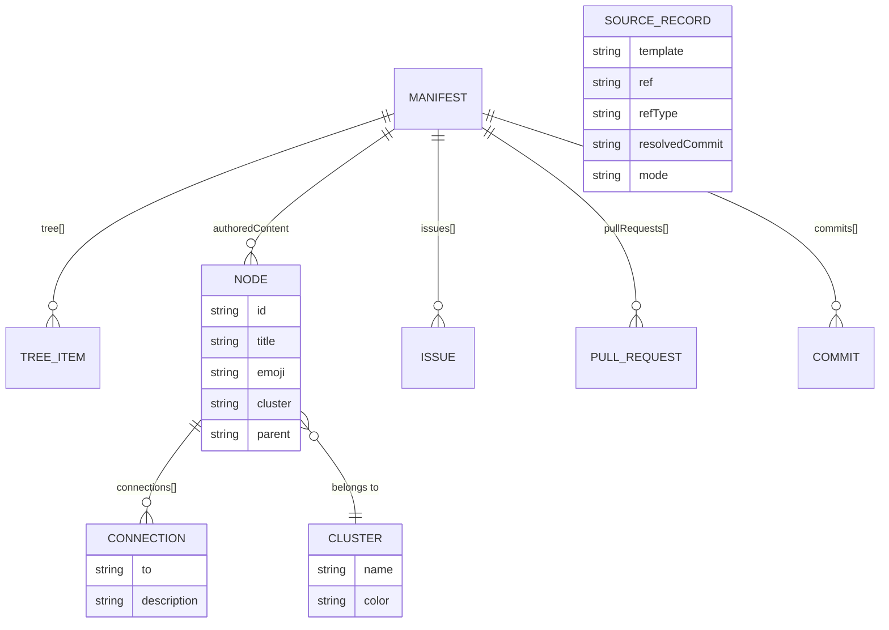
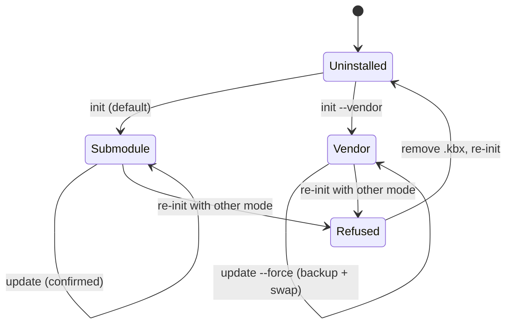
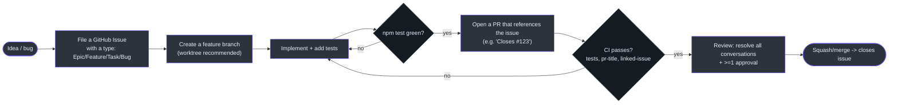
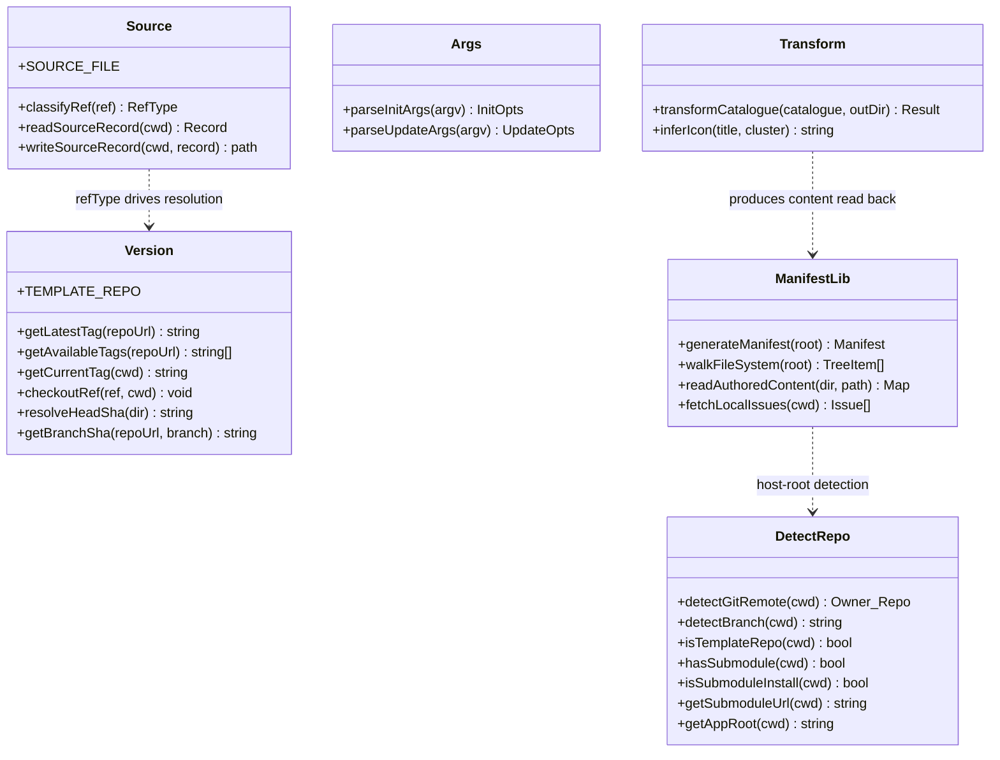
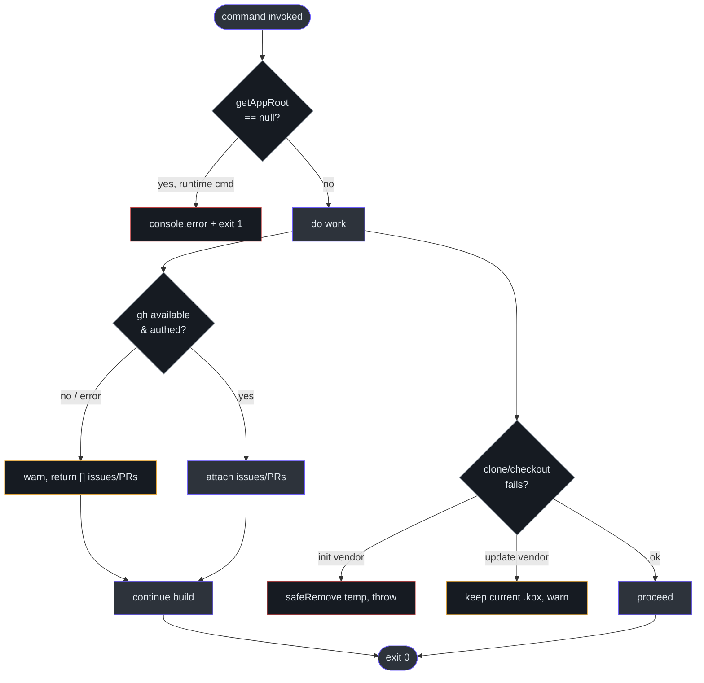

# Contributor Guide — kbexplorer-cli

**Audience:** engineers who work on the kbx **CLI codebase** — whether you're landing
your first PR or making deep architectural changes. Assumes you're comfortable with JavaScript
and general software engineering. This repo is **modern Node.js (ES modules), Node ≥ 22, with
zero runtime dependencies**, so there is no language-foundations section to wade through — if
you know JS and `async/await`, you know enough to start. Every claim links to source on `main`.

> **Two audiences, one guide.** Parts II–III get you productive fast (structure, patterns,
> setup, first PR, tests). **Part IV — Architecture & internals** is the deep "why" for
> staff/principal-level changes: the core design insight, decision log, failure modes, security
> model, and tech debt. New contributors can skip Part IV until they need it; reviewers and
> anyone changing install/update behavior should read it.

> **Skip note:** The skill template includes a "Foundations" part for repos in unfamiliar
> languages. This repo is JavaScript, so that part is intentionally omitted. We dive straight
> into the codebase.

---

## Table of contents

**Part II — This codebase**
1. [What this project does](#1-what-this-project-does)
2. [Project structure](#2-project-structure)
3. [Core concepts](#3-core-concepts)
4. [Command lifecycle](#4-command-lifecycle)
5. [Key patterns](#5-key-patterns)

**Part III — Getting productive**
6. [Prerequisites & setup](#6-prerequisites--setup)
7. [Your first task](#7-your-first-task)
8. [Development workflow](#8-development-workflow)
9. [Running tests](#9-running-tests)
10. [Debugging guide](#10-debugging-guide)
11. [Common pitfalls](#11-common-pitfalls)

**Part IV — Architecture & internals** (for deeper changes)
12. [The core architectural insight](#12-the-core-architectural-insight)
13. [Key abstractions & interfaces](#13-key-abstractions--interfaces)
14. [Data invariants](#14-data-invariants)
15. [Decision log](#15-decision-log)
16. [Dependency rationale](#16-dependency-rationale)
17. [Data flow & state](#17-data-flow--state)
18. [Failure modes & error handling](#18-failure-modes--error-handling)
19. [Performance characteristics](#19-performance-characteristics)
20. [Security model](#20-security-model)
21. [Testing strategy](#21-testing-strategy)
22. [Known technical debt](#22-known-technical-debt)
23. [Where to go deep](#23-where-to-go-deep)

**Appendices**
- [Glossary](#appendix-a-glossary)
- [Key file reference](#appendix-b-key-file-reference)
- [Quick reference card](#appendix-c-quick-reference-card)

---

## 1. What this project does

kbexplorer-cli is a CLI that **turns any GitHub repository into a navigable knowledge graph.**
Running `npx kbx init` in a repo installs a visual "explorer" web app (the *template*),
copies in a set of Copilot agents/skills, and configures everything. Later commands generate a
*manifest* of the repo (file tree, README, issues, PRs, commits, authored markdown) that the
explorer renders as an interactive constellation of cards and a force-directed graph.

This repo is **only the CLI** — the installer and orchestrator. The web app it installs lives
in a separate repo, [`anokye-labs/kbexplorer-template`](https://github.com/anokye-labs/kbexplorer-cli/blob/main/src/lib/version.js#L12).
The CLI ships **no runtime dependencies**; it shells out to `git`, the `gh` CLI, and `vite`
(which comes from the template).

---

## 2. Project structure

```
kbexplorer-cli/
├── bin/
│   └── cli.js                # Entry point. Routes argv[0] -> a command module.
├── src/
│   ├── commands/             # One module per CLI command (the orchestration layer)
│   │   ├── init.js           #   install template + assets + interactive config wizard
│   │   ├── update.js         #   refresh assets + update template (per install mode)
│   │   ├── generate.js       #   transform catalogue.json -> content/, rebuild manifest
│   │   ├── dev.js            #   build manifest + spawn the Vite dev server
│   │   ├── build.js          #   build manifest + Vite production build -> dist/kb/
│   │   ├── manifest.js       #   regenerate the manifest only
│   │   ├── links.js          #   soft graph health report (orphans, weak clusters, gaps)
│   │   ├── audit.js          #   hard structural lint (duplicate ids, broken parents, cycles)
│   │   ├── affected.js       #   map git diff -> impacted content nodes via citations
│   │   └── scaffold.js       #   create one content/<slug>.md with valid frontmatter
│   ├── lib/                  # Shared, dependency-free logic (the reusable "heart")
│   │   ├── detect-repo.js    #   git remote/branch detection + getAppRoot (the seam)
│   │   ├── version.js        #   remote tag/SHA lookups, checkout helpers
│   │   ├── source.js         #   read/write .kbx.json + classifyRef
│   │   ├── args.js           #   pure flag parsers (parseInitArgs/parseUpdateArgs)
│   │   ├── manifest.js       #   generateManifest: repo -> JSON snapshot
│   │   ├── transform.js      #   catalogue JSON -> content/*.md + config.yaml
│   │   ├── frontmatter.js    #   zero-dep YAML frontmatter parse + citation extraction
│   │   ├── audit.js          #   schema validator (rules: duplicate-id, broken-parent, ...)
│   │   └── affected.js       #   citation index + diff -> nodes mapping
│   └── assets/               # Files copied into a host repo's .github/ during init
│       ├── agents/           #   kb-architect, kb-writer, kb-researcher (Copilot agents)
│       └── skills/kbexplorer/#   slim router SKILL.md + 15 task-focused references/
├── tests/
│   ├── lib/                  # Unit tests for each lib module (node:test)
│   └── commands/             # Command-level tests (links, scaffold)
├── .github/workflows/        # CI: publish, pr-title, linked-issue, dependency-review
├── package.json              # name, bin, "test" script, engines.node >=22, NO deps
├── AGENTS.md                 # Org rules: issue-first workflow, branch protection
└── README.md
```

The mental split that matters: **`src/commands` is thin orchestration; `src/lib` is the
tested, reusable logic.** When in doubt, put pure logic in `lib` (and test it) and keep
`commands` as glue.

### Architecture overview

```mermaid
graph TB
    user([Developer / CI]):::actor --> cli["bin/cli.js<br>command router"]:::core

    subgraph cmds["src/commands"]
        init["init"]:::node
        update["update"]:::node
        generate["generate"]:::node
        dev["dev"]:::node
        build["build"]:::node
        manifestcmd["manifest"]:::node
        links["links"]:::node
        audit["audit"]:::node
        affected["affected"]:::node
        scaffold["scaffold"]:::node
    end
    cli --> cmds

    subgraph lib["src/lib"]
        detect["detect-repo.js"]:::heart
        source["source.js"]:::heart
        version["version.js"]:::node
        args["args.js"]:::node
        mlib["manifest.js"]:::node
        transform["transform.js"]:::node
        frontmatter["frontmatter.js"]:::node
        auditlib["audit.js"]:::node
        affectedlib["affected.js"]:::node
    end
    cmds --> lib

    lib --> ext["git / gh / vite (shelled out)"]:::ext

    classDef actor fill:#2d333b,stroke:#6d5dfc,color:#e6edf3
    classDef core fill:#2d333b,stroke:#39FF14,color:#e6edf3
    classDef node fill:#2d333b,stroke:#6d5dfc,color:#e6edf3
    classDef heart fill:#161b22,stroke:#39FF14,color:#e6edf3
    classDef ext fill:#161b22,stroke:#8b949e,color:#e6edf3
```



<!-- Sources: bin/cli.js:22-30, src/commands/*, src/lib/* -->

---

## 3. Core concepts

These are the domain terms you'll see everywhere. Learn them once and the code reads easily.

- **Host repo** — the repository a user runs `kbx init` in. The CLI installs into it.
- **Template / explorer app** — the Vite web app that renders the graph. Installed at
  `.kbx/`. Lives in a separate repo by default.
- **Self-hosted mode** — running the CLI *inside* the template repo itself. Detected by
  `isTemplateRepo` (the `package.json` name is `kbx`/`kbexplorer-template`)
  ([`detect-repo.js:45-52`](https://github.com/anokye-labs/kbexplorer-cli/blob/main/src/lib/detect-repo.js#L45-L52)). No submodule needed.
- **App root** — the directory of the explorer app for the current context, resolved by
  `getAppRoot` ([`detect-repo.js:109-114`](https://github.com/anokye-labs/kbexplorer-cli/blob/main/src/lib/detect-repo.js#L109-L114)). Either the repo root (self-hosted) or `.kbx/`.
- **Install mode** — `submodule` (default; a pinned git submodule) or `vendor` (a one-time
  copy with `.git` stripped). Chosen by the `--vendor` flag in `init`.
- **Source record** — `.kbx.json` at the host repo root: `{ template, ref, refType,
  resolvedCommit, mode }`. The CLI-owned record of where the template came from
  ([`source.js:8-15`](https://github.com/anokye-labs/kbexplorer-cli/blob/main/src/lib/source.js#L8-L15)).
- **Ref type** — `release` (track latest semver tag), `tag` (pinned), or `branch` (track
  HEAD). Derived from a ref string by `classifyRef` ([`source.js:32-35`](https://github.com/anokye-labs/kbexplorer-cli/blob/main/src/lib/source.js#L32-L35)).
- **Manifest** — the JSON snapshot the explorer reads, built by `generateManifest`
  ([`manifest.js:284-314`](https://github.com/anokye-labs/kbexplorer-cli/blob/main/src/lib/manifest.js#L284-L314)).
- **Catalogue** — the JSON the `kb-architect` agent produces; `transformCatalogue` turns it
  into `content/*.md` nodes ([`transform.js:147-235`](https://github.com/anokye-labs/kbexplorer-cli/blob/main/src/lib/transform.js#L147-L235)).
- **Node / cluster / connection** — the graph model. A *node* is a page (markdown +
  frontmatter); a *cluster* is a colored group; a *connection* is an edge `{ to, description }`.
- **Content mode** — `repo-aware` (auto from issues/PRs/README/tree), `authored` (hand-written
  markdown), or both. Chosen in the init wizard.

### Data model



<!-- Sources: src/lib/manifest.js:296-305, src/lib/transform.js:186-201, src/lib/source.js:8-15 -->

### Install state

A host repo moves through a small state machine driven by `init`/`update`. Knowing it helps
you reason about why `update` sometimes refuses to act:



<!-- Sources: src/commands/init.js:191-221, src/commands/update.js:79-266 -->

---

## 4. Command lifecycle

Every invocation flows through the same tiny router. Here's `kbx dev` end to end:

```mermaid
sequenceDiagram
    autonumber
    actor Dev as Developer
    participant CLI as bin/cli.js
    participant Cmd as commands/dev.js
    participant Detect as lib/detect-repo.js
    participant MLib as lib/manifest.js
    participant Sh as git / gh (shell)
    participant Vite as vite (template)

    Dev->>CLI: npx kbx dev
    CLI->>CLI: command = argv[0]; look up COMMANDS[command]
    CLI->>Cmd: await import(...).default(args.slice(1))
    Cmd->>Detect: getAppRoot(cwd)
    Detect-->>Cmd: ".kbx/" (or null -> error + exit 1)
    Cmd->>MLib: generateManifest(cwd)
    MLib->>Sh: walk FS, read README/config, gh issue/pr list, git log
    Sh-->>MLib: issues/PRs/commits (best-effort)
    MLib-->>Cmd: manifest object
    Cmd->>Vite: spawn npx vite --open (cwd = appRoot)
    Vite-->>Dev: dev server on http://localhost:5173
```

<!-- Sources: bin/cli.js:77-84, src/commands/dev.js:9-41, src/lib/detect-repo.js:109-114 -->

The router itself is a lookup table + dynamic import — read it first, it's ~85 lines
([`bin/cli.js:22-84`](https://github.com/anokye-labs/kbexplorer-cli/blob/main/bin/cli.js#L22-L84)). Each command module exports a default `async function(args)`.

---

## 5. Key patterns

Copy these patterns when extending the CLI. They reflect how the codebase already works.

### Pattern: add a new command

1. Create `src/commands/foo.js` exporting a default async function:

```js
// src/commands/foo.js
import { getAppRoot } from '../lib/detect-repo.js';

export default async function foo(args) {
  const cwd = process.cwd();
  const appRoot = getAppRoot(cwd);
  if (!appRoot) {
    console.error('✗ kbx not found. Run `kbx init` first.');
    process.exit(1);
  }
  // ... do work ...
}
```

2. Register it in the router map and (optionally) the usage text:

```js
// bin/cli.js — add to COMMANDS
const COMMANDS = {
  // ...existing...
  foo: '../src/commands/foo.js',
};
```

The router calls `mod.default(args.slice(1))`, so your function receives only the args after
the command name ([`bin/cli.js:83-84`](https://github.com/anokye-labs/kbexplorer-cli/blob/main/bin/cli.js#L83-L84)).

### Pattern: add a flag

Flags are parsed by pure functions in `args.js` — never hand-roll parsing in a command. Extend
`parseInitArgs`/`parseUpdateArgs` and add a unit test:

```js
// src/lib/args.js — inside parseInitArgs' switch
case '--quiet':
case '-q':
  out.quiet = true;
  break;
```

Because these parsers are pure (no I/O), they're trivially testable — see
[`tests/lib/args.test.js`](https://github.com/anokye-labs/kbexplorer-cli/blob/main/tests/lib/args.test.js). This is the single best place to learn the project's testing style.

### Pattern: resolve the app root (don't branch on install mode)

Anything that needs the explorer app calls `getAppRoot(cwd)`. **Do not** check for submodule
vs vendor — that's exactly what the seam hides. A vendored copy and a submodule are the same
to runtime code ([`detect-repo.js:109-114`](https://github.com/anokye-labs/kbexplorer-cli/blob/main/src/lib/detect-repo.js#L109-L114)).

### Pattern: a side effect that can fail (best-effort)

Wrap optional side effects in `try/catch`, warn, and continue with a valid-but-degraded
result. This is how GitHub data is fetched ([`manifest.js:181-213`](https://github.com/anokye-labs/kbexplorer-cli/blob/main/src/lib/manifest.js#L181-L213)):

```js
try {
  const json = execSync('gh issue list --json ... --limit 200', { cwd, encoding: 'utf-8' });
  return JSON.parse(json).map(/* normalize */);
} catch (err) {
  console.warn('[generate-manifest] Failed to fetch issues:', err.message);
  return []; // degrade, don't crash
}
```

Reserve `process.exit(1)` for "nothing can proceed" (no app root; clone failed).

### Pattern: a destructive filesystem op (atomic + safe)

Never write into the final location until success is certain. `installVendor` clones to a
sibling temp dir, validates, then `renameSync` into place; failures `safeRemove` the temp
([`init.js:125-148`](https://github.com/anokye-labs/kbexplorer-cli/blob/main/src/commands/init.js#L125-L148)). Use `safeRemove` (which sets `maxRetries`/`retryDelay` for
Windows file locks) rather than a bare `rmSync` ([`init.js:80-84`](https://github.com/anokye-labs/kbexplorer-cli/blob/main/src/commands/init.js#L80-L84)).

---

## 6. Prerequisites & setup

| Tool | Version | Install |
|------|---------|---------|
| Node.js | **≥ 22** (required by `engines`) | https://nodejs.org or `nvm install 22` |
| npm | bundled with Node 22 | — |
| git | any recent | https://git-scm.com |
| gh CLI | optional, for issues/PRs | https://cli.github.com |

### Clone and verify

```bash
git clone https://github.com/anokye-labs/kbexplorer-cli.git
cd kbexplorer-cli
node --version        # must print v22.x or higher
```

Expected:

```
v22.11.0
```

### Install dev dependencies

There are **no runtime dependencies**, and `npm install` is mostly a no-op (it sets up the
lockfile). You do not need it to run the CLI or the tests:

```bash
npm install --no-audit --no-fund
```

Expected (roughly):

```
up to date, audited 1 package in 200ms
found 0 vulnerabilities
```

### Run the CLI from source

```bash
node bin/cli.js --help
```

Expected (abridged) — note the `init options` block:

```
  kbx — Interactive Knowledge Base Explorer CLI

  Usage: kbx <command> [options]

  Commands:
    init        Add .kbx submodule, install agents/skills, configure
    generate    Run content generation pipeline (architect → transform → writer)
    ...
  init options:
    --template, -t <url>       Install from a custom template repo
    --ref, --branch <ref>      Install a specific tag or branch
    --vendor, --no-submodule   One-time copy instead of a git submodule
```

(Source of that text: [`bin/cli.js:32-64`](https://github.com/anokye-labs/kbexplorer-cli/blob/main/bin/cli.js#L32-L64).)

### Run the tests

```bash
npm test
```

Expected tail:

```
ℹ tests 53
ℹ pass 53
ℹ fail 0
```

If you see `53 pass`, your environment is good.

---

## 7. Your first task

Let's make a small, representative change end to end: **add a `--quiet` / `-q` flag to
`parseInitArgs`**, fully unit-tested, no network. This touches exactly the right files to
learn the workflow (`args.js` + its test) and mirrors how every flag in the project is built.

> This is an illustrative walkthrough. In real work you'd start from a GitHub issue (see §8);
> here we focus on the code loop.

### Step 1 — write the test first

Open [`tests/lib/args.test.js`](https://github.com/anokye-labs/kbexplorer-cli/blob/main/tests/lib/args.test.js) and add a case inside the `parseInitArgs` describe block:

```js
it('parses --quiet and -q', () => {
  assert.strictEqual(parseInitArgs(['--quiet']).quiet, true);
  assert.strictEqual(parseInitArgs(['-q']).quiet, true);
  assert.strictEqual(parseInitArgs([]).quiet, false);
});
```

Run it and watch it fail (red):

```bash
npm test
```

Expected: a failing assertion, because `quiet` doesn't exist yet (`undefined !== true`).

### Step 2 — implement the flag

In [`src/lib/args.js`](https://github.com/anokye-labs/kbexplorer-cli/blob/main/src/lib/args.js), add `quiet: false` to the `out` default and a switch case:

```js
export function parseInitArgs(args = []) {
  const out = { template: null, ref: null, vendor: false, quiet: false, help: false, unknown: [] };
  for (let i = 0; i < args.length; i++) {
    const a = args[i];
    switch (a) {
      // ...existing cases...
      case '--quiet':
      case '-q':
        out.quiet = true;
        break;
      // ...
    }
  }
  return out;
}
```

### Step 3 — make the test pass (green)

```bash
npm test
```

Expected: `pass 54  fail 0` (your new test plus the existing 53).

> If you also changed the default-shape assertion test (the one that does
> `deepStrictEqual(parseInitArgs([]), { ... })`), update it to include `quiet: false` — that
> test asserts the **exact** object shape ([`args.test.js:7-11`](https://github.com/anokye-labs/kbexplorer-cli/blob/main/tests/lib/args.test.js#L7-L11)).

### Step 4 — wire it up (optional)

If the flag should actually do something, read it in `init.js` (e.g. gate `console.log`
calls on `!opts.quiet`). For this walkthrough, the parser + test is enough to demonstrate the
loop.

### Step 5 — review your diff

```bash
git diff
```

You changed two files: `src/lib/args.js` and `tests/lib/args.test.js`. That's a clean,
test-backed unit of work — the shape every contribution should take.

---

## 8. Development workflow

This repo enforces an **issue-first, PR-only** workflow with branch protection. Read
[`AGENTS.md`](https://github.com/anokye-labs/kbexplorer-cli/blob/main/AGENTS.md) and [`CONTRIBUTING.md`](https://github.com/anokye-labs/kbexplorer-cli/blob/main/CONTRIBUTING.md) — the rules are enforced in CI, not just by convention.



<!-- Sources: AGENTS.md:1-62, CONTRIBUTING.md, .github/workflows/linked-issue.yml, .github/workflows/pr-title.yml -->

**Hard rules (CI-enforced):**

- **Every PR must reference an issue.** The `linked-issue` workflow scans the PR title/body
  for `#123`, `Closes #123`, an issue URL, etc., and fails otherwise
  ([`linked-issue.yml:50-64`](https://github.com/anokye-labs/kbexplorer-cli/blob/main/.github/workflows/linked-issue.yml#L50-L64)).
- **Every issue needs a real Issue Type** (Epic/Feature/Task/Bug) — the GitHub Issue Type
  field, **not** a label or `[TASK]` title prefix ([`AGENTS.md:32-43`](https://github.com/anokye-labs/kbexplorer-cli/blob/main/AGENTS.md#L32-L43)). Issue types,
  sub-issues, and relationships are managed via the **GraphQL** API.
- **PR titles** can't be empty, `WIP`, `draft`, or `do not merge`
  ([`pr-title.yml:37-46`](https://github.com/anokye-labs/kbexplorer-cli/blob/main/.github/workflows/pr-title.yml#L37-L46)).
- **No direct pushes to `main`.** Branch protection blocks it; force pushes and branch
  deletion are blocked; all PR conversations must be resolved before merge
  ([`AGENTS.md:3-21`](https://github.com/anokye-labs/kbexplorer-cli/blob/main/AGENTS.md#L3-L21)).

**Commit convention:** descriptive messages (the repo uses Conventional-Commit-style prefixes
like `feat(init): …` in history). Tags `v*` trigger npm publish via the `publish` workflow
([`publish.yml:3-5`](https://github.com/anokye-labs/kbexplorer-cli/blob/main/.github/workflows/publish.yml#L3-L5)).

---

## 9. Running tests

The project uses Node's **built-in** test runner — no Jest, no Vitest (consistent with the
zero-dependency posture). The script is just `node --test`
([`package.json:10`](https://github.com/anokye-labs/kbexplorer-cli/blob/main/package.json#L10)).

```bash
# All tests
npm test

# A single test file
node --test tests/lib/args.test.js

# Filter by test name
node --test --test-name-pattern="classifyRef" tests/lib/source.test.js

# Watch mode while iterating
node --test --watch tests/lib/args.test.js
```

Expected `npm test` tail:

```
ℹ tests 53
ℹ suites 17
ℹ pass 53
ℹ fail 0
```

**Test conventions** (study [`tests/lib/source.test.js`](https://github.com/anokye-labs/kbexplorer-cli/blob/main/tests/lib/source.test.js) as the model):

- `import { describe, it } from 'node:test'` + `import assert from 'node:assert/strict'`.
- Tests target **pure functions only** — no network, no real git. Functions that shell out
  (`version.js` remote calls, `manifest.js` `gh` calls) are deliberately not unit-tested.
- Filesystem tests use a unique `tmpdir()` directory and clean up with `rmSync`
  ([`source.test.js:10-14`](https://github.com/anokye-labs/kbexplorer-cli/blob/main/tests/lib/source.test.js#L10-L14)).
- Modules are loaded with dynamic `await import(...)` at the top of the test file.

---

## 10. Debugging guide

| Symptom | Likely cause | Fix |
|---------|--------------|-----|
| `✗ kbx not found. Run kbx init first.` | `getAppRoot` returned `null` — no `.kbx/package.json` | Run `init`, or run from the host repo root ([`detect-repo.js:109-114`](https://github.com/anokye-labs/kbexplorer-cli/blob/main/src/lib/detect-repo.js#L109-L114)) |
| Empty graph / no issues or PRs | `gh` not installed or not authenticated | Install/auth `gh`, or accept the degraded build (warns, continues) ([`manifest.js:168-175`](https://github.com/anokye-labs/kbexplorer-cli/blob/main/src/lib/manifest.js#L168-L175)) |
| GitHub rate-limit warnings | 60 unauth requests/hour | Set `GITHUB_TOKEN` / `gh auth login` ([`references/setup.md`](https://github.com/anokye-labs/kbexplorer-cli/blob/main/src/assets/skills/kbexplorer/references/setup.md)) |
| `git submodule add` fails with `file://` locally | Git blocks the file protocol for submodules by default | Use a real `https` URL, or test vendor mode (`--vendor`) which uses `git clone` |
| Test fails after adding a flag | The exact-shape default test wasn't updated | Update the `deepStrictEqual` default-shape assertion ([`args.test.js:7-11`](https://github.com/anokye-labs/kbexplorer-cli/blob/main/tests/lib/args.test.js#L7-L11)) |
| `update` says "Already up to date" unexpectedly | `resolvedCommit` in `.kbx.json` matches remote SHA | Expected — it compares SHAs ([`update.js:228-232`](https://github.com/anokye-labs/kbexplorer-cli/blob/main/src/commands/update.js#L228-L232)) |
| Windows: delete fails / EBUSY | File lock during `rmSync` | Use `safeRemove` (retries built in) instead of bare `rmSync` ([`init.js:80-84`](https://github.com/anokye-labs/kbexplorer-cli/blob/main/src/commands/init.js#L80-L84)) |

**General technique:** because the CLI is just Node, you can debug any command directly:

```bash
node --inspect-brk bin/cli.js links --json
```

…then attach Chrome DevTools or VS Code. Most logic lives in synchronous `lib` functions, so
stepping through is straightforward.

---

## 11. Common pitfalls

1. **Adding a runtime dependency.** Don't. The zero-dep posture is a core design decision
   ([no `dependencies` in `package.json`](https://github.com/anokye-labs/kbexplorer-cli/blob/main/package.json)). Use Node built-ins or shell out.
2. **Branching on install mode in a command.** Use `getAppRoot`. Submodule vs vendor is
   invisible to runtime code by design — don't reintroduce the distinction.
3. **Hand-rolling arg parsing in a command.** Extend `args.js` and add a test instead.
4. **Writing into `.kbx/` before success.** Use the temp-dir + `renameSync` pattern so
   a failure can't leave a half-installed app ([`init.js:132-146`](https://github.com/anokye-labs/kbexplorer-cli/blob/main/src/commands/init.js#L132-L146)).
5. **Forgetting the exact-shape default test.** `parseInitArgs([])` is asserted with
   `deepStrictEqual` — any new field breaks it until you update the expected object.
6. **Hard-failing on missing GitHub data.** A partial graph beats a crash; degrade with a
   warning like the existing `gh` paths do.
7. **Opening a PR without an issue reference.** CI (`linked-issue`) will fail it. File the
   issue first, reference it in the PR body.
8. **Forgetting backslash paths on Windows.** This is a cross-platform CLI; prefer
   `node:path` helpers (`resolve`, `join`) over string concatenation, as the code does.
9. **Testing functions that shell out.** Don't add network/git to unit tests — keep the test
   tier offline and deterministic; verify side-effecting code by smoke test.

---

# Part IV — Architecture & internals

> Read this part when you're reviewing PRs, changing install/update behavior, or you just want
> the complete mental model. It's the "why" behind the patterns in Part II. Diagrams that
> already appear above (the architecture `graph`, the data-model `erDiagram`, the install
> `stateDiagram`, the command `sequenceDiagram`) are not repeated here — this part adds the
> decision-level detail.

## 12. The core architectural insight

If you internalize one thing, make it this: **the runtime is install-mode-agnostic because all
downstream commands resolve the template through one function, and install/update logic is
decoupled from the hardcoded template URL by one declarative record.**

Concretely, every command that needs the explorer app calls `getAppRoot(cwd)`. It returns the
repo root when self-hosted (the CLI is run *inside* the template), `.kbx/` when the
template is installed in a host repo, or `null` when nothing is installed — and it decides
purely on the presence of a `package.json`, never on *how* the folder got there
([`src/lib/detect-repo.js:109-114`](https://github.com/anokye-labs/kbexplorer-cli/blob/main/src/lib/detect-repo.js#L109-L114)).
A vendored copy and a git submodule are indistinguishable to `dev`, `build`, and `manifest`.
That is why adding "vendor mode" required **zero** changes to those commands.

Expressed as pseudocode (Python, deliberately not this repo's language) the whole resolution
seam is this small:

```python
def get_app_root(cwd):
    if is_template_repo(cwd):           # package.json name == kbx[-template]
        return cwd                      # self-hosted: the repo *is* the app
    candidate = path.join(cwd, ".kbx")
    if exists(path.join(candidate, "package.json")):
        return candidate                # host repo: submodule OR vendored copy — same thing
    return None                         # not installed

# Every runtime command is just:
def run(cmd, cwd):
    app_root = get_app_root(cwd)
    if app_root is None:
        fail("run `kbx init` first")
    do_work(app_root)
```

The second half of the seam is the **source record**. Historically the template URL was a
hardcoded constant. Install and update now read a declarative `.kbx.json` —
`{ template, ref, refType, resolvedCommit, mode }` — so the host repo, not the CLI binary, is
the source of truth for "where did this come from and how do I update it"
([`src/lib/source.js:1-63`](https://github.com/anokye-labs/kbexplorer-cli/blob/main/src/lib/source.js#L1-L63)).
The constant survives only as a *default*
([`src/lib/version.js:12`](https://github.com/anokye-labs/kbexplorer-cli/blob/main/src/lib/version.js#L12)).

**Why it matters:** these two seams convert what would be a matrix of special cases
(`{submodule, vendor} × {dev, build, manifest, update} × {default, custom template}`) into a
couple of orthogonal decisions resolved at the edges. The blast radius of a new install mode is
contained to `init`/`update`; the blast radius of a custom template is contained to a JSON file.

---

## 13. Key abstractions & interfaces

There are no classes — the codebase is module-of-functions ESM. The "interfaces" are the
function contracts of `src/lib`. Modeled as a class diagram for shape:



<!-- Sources: src/lib/detect-repo.js, src/lib/source.js, src/lib/version.js, src/lib/args.js, src/lib/manifest.js, src/lib/transform.js -->

For readers from typed backgrounds, the mapping is: an ESM `export function` is your public
interface method; there is no DI container — modules import each other directly; "null object"
is the idiom for absence (`getAppRoot` returns `null`, callers branch). `execSync(...)` is the
universal side-effect primitive, equivalent to a shelled subprocess call.

---

## 14. Data invariants

| Entity | Invariant | Enforced by | Source |
|--------|-----------|-------------|--------|
| Source record | `refType ∈ {release, tag, branch}`, derived from `ref` | `classifyRef` (null→release, semver→tag, else→branch) | [`source.js:32-35`](https://github.com/anokye-labs/kbexplorer-cli/blob/main/src/lib/source.js#L32-L35) |
| Source record | A `release` install always resolves to a concrete tag before writing | `installSubmodule`/`installVendor` resolve latest tag | [`init.js:94-98`](https://github.com/anokye-labs/kbexplorer-cli/blob/main/src/commands/init.js#L94-L98), [`:128-130`](https://github.com/anokye-labs/kbexplorer-cli/blob/main/src/commands/init.js#L128-L130) |
| Source record | `resolvedCommit` captures the exact installed SHA for reproducibility | `resolveHeadSha` after clone/checkout | [`version.js:97-107`](https://github.com/anokye-labs/kbexplorer-cli/blob/main/src/lib/version.js#L97-L107) |
| App root | Resolves only when `.kbx/package.json` exists | `getAppRoot` / `hasSubmodule` | [`detect-repo.js:58-114`](https://github.com/anokye-labs/kbexplorer-cli/blob/main/src/lib/detect-repo.js#L58-L114) |
| Vendor install | `.kbx/` never contains a `.git` dir (it's a copy, not a clone) | `installVendor` strips `.git` before rename | [`init.js:141`](https://github.com/anokye-labs/kbexplorer-cli/blob/main/src/commands/init.js#L141) |
| Install atomicity | A failed clone never leaves a half-installed `.kbx/` | clone-to-sibling-temp, validate, then `renameSync` | [`init.js:132-146`](https://github.com/anokye-labs/kbexplorer-cli/blob/main/src/commands/init.js#L132-L146) |
| Authored node | Edges only form between IDs that exist in the node set | `analyzeGraph` membership check | [`links.js:119-127`](https://github.com/anokye-labs/kbexplorer-cli/blob/main/src/commands/links.js#L119-L127) |

---

## 15. Decision log

| Decision | Alternatives considered | Rationale | Source |
|----------|-------------------------|-----------|--------|
| Zero runtime dependencies; shell out to `git`/`gh`/`vite` | Octokit, commander/oclif, bundled deps | Fast `npx`, tiny supply chain, tools already present | [`package.json`](https://github.com/anokye-labs/kbexplorer-cli/blob/main/package.json) (no `dependencies`) |
| Mode-agnostic `getAppRoot` | Branch on submodule vs vendor everywhere | Confines install-mode knowledge to `init`/`update` | [`detect-repo.js:109-114`](https://github.com/anokye-labs/kbexplorer-cli/blob/main/src/lib/detect-repo.js#L109-L114) |
| CLI-owned `.kbx.json` source record | Rely on `.gitmodules`; keep hardcoded const | Vendor installs have no `.gitmodules`; record is the single source of truth | [`source.js:1-63`](https://github.com/anokye-labs/kbexplorer-cli/blob/main/src/lib/source.js#L1-L63) |
| Store `resolvedCommit` (SHA), not just a ref | Store only the mutable ref | Reproducibility; detect "already up to date" by SHA | [`update.js:228-232`](https://github.com/anokye-labs/kbexplorer-cli/blob/main/src/commands/update.js#L228-L232) |
| Atomic vendor install (temp + rename) | Clone straight into `.kbx/` | A failed clone must not leave a broken install | [`init.js:132-146`](https://github.com/anokye-labs/kbexplorer-cli/blob/main/src/commands/init.js#L132-L146) |
| Vendor `update` never clobbers; `--force` backs up | Overwrite in place | Vendored copies hold user customizations | [`update.js:243-265`](https://github.com/anokye-labs/kbexplorer-cli/blob/main/src/commands/update.js#L243-L265) |
| Refuse mode conversion on re-init | Auto-convert submodule<->vendor | Conversion is lossy/ambiguous; force explicit intent | [`init.js:211-221`](https://github.com/anokye-labs/kbexplorer-cli/blob/main/src/commands/init.js#L211-L221) |
| `gh`/git data is best-effort | Hard-fail without GitHub data | A partial graph beats no build | [`manifest.js:182-247`](https://github.com/anokye-labs/kbexplorer-cli/blob/main/src/lib/manifest.js#L182-L247) |
| Built-in `node --test`, no test framework | Jest/Vitest/Mocha | Keep zero-dep posture into the test tier | [`package.json:10`](https://github.com/anokye-labs/kbexplorer-cli/blob/main/package.json#L10) |

---

## 16. Dependency rationale

| Dependency | Purpose | What it replaced | Source |
|------------|---------|------------------|--------|
| `git` (shell) | Submodule add, clone, checkout, log, ls-remote | A Git library / API SDK | [`version.js:18-126`](https://github.com/anokye-labs/kbexplorer-cli/blob/main/src/lib/version.js#L18-L126) |
| `gh` CLI (shell) | Issues & PRs with the user's existing auth | Octokit + token plumbing | [`manifest.js:181-247`](https://github.com/anokye-labs/kbexplorer-cli/blob/main/src/lib/manifest.js#L181-L247) |
| `vite` (in template) | Dev server & production build | A bundler dependency in the CLI | [`dev.js:29-38`](https://github.com/anokye-labs/kbexplorer-cli/blob/main/src/commands/dev.js#L29-L38), [`build.js:42-52`](https://github.com/anokye-labs/kbexplorer-cli/blob/main/src/commands/build.js#L42-L52) |
| Node built-ins (`fs`, `path`, `child_process`, `readline`, `url`) | Everything else | Third-party utilities | throughout `src/` |

The discipline is strict: the CLI has **no `dependencies` block at all**. Every capability is
either a Node built-in or a shelled tool. This is the single biggest maintenance-cost lever in
the codebase — protect it.

---

## 17. Data flow & state

State lives in three places, all on disk in the host repo — there is no in-process persistence
between command invocations:

1. **Install state** — `.kbx/` (the app), `.kbx.json` (the record),
   `.gitmodules` (submodule mode only).
2. **Config/runtime state** — `.env.kbx` (Vite vars: owner, repo, branch, title, path)
   written by `init` ([`init.js:252-261`](https://github.com/anokye-labs/kbexplorer-cli/blob/main/src/commands/init.js#L252-L261)).
3. **Derived state** — the manifest at `src/generated/repo-manifest.json` and `content/*.md`,
   both regenerated on demand and safe to delete.

Data flow for content generation: `kb-architect` (agent) → `catalogue.json` →
`transformCatalogue` → `content/*.md` + `content/config.yaml` → `generateManifest` → manifest →
template renders.

| Store | Lifetime | Authoritative for | Rebuildable? |
|-------|----------|-------------------|--------------|
| `.kbx.json` | Permanent (committed) | Where the template came from | No — it *is* the source of truth |
| `.kbx/` | Permanent | The explorer app | Yes — re-init / update |
| `.env.kbx` | Permanent (gitignored) | Owner/repo/branch/title | Re-run `init` |
| `content/*.md` | Permanent (authored) | Hand-written graph nodes | Partially (agents regenerate skeletons) |
| `repo-manifest.json` | Ephemeral | Snapshot for the UI | Yes — every `dev`/`build`/`manifest` |

---

## 18. Failure modes & error handling

The dominant idiom is **best-effort with graceful degradation**: wrap a side effect in
`try/catch`, warn, and continue with a degraded-but-valid result. Hard failures are reserved for
"nothing can proceed" (no app root; clone failed).



<!-- Sources: src/commands/dev.js:13-16, src/lib/manifest.js:168-247, src/commands/init.js:134-146, src/commands/update.js:218-252 -->

| Failure | Behavior | Source |
|---------|----------|--------|
| No `.kbx/` for a runtime command | `console.error` + `exit 1` | [`dev.js:13-16`](https://github.com/anokye-labs/kbexplorer-cli/blob/main/src/commands/dev.js#L13-L16) |
| `gh` missing or rate-limited | Warn, return empty issues/PRs, build continues | [`manifest.js:168-213`](https://github.com/anokye-labs/kbexplorer-cli/blob/main/src/lib/manifest.js#L168-L213) |
| Vendor clone fails during `init` | Remove temp dir, throw, exit 1 (no partial install) | [`init.js:134-146`](https://github.com/anokye-labs/kbexplorer-cli/blob/main/src/commands/init.js#L134-L146) |
| Vendor update fetch fails | Remove review dir, keep current install, return | [`update.js:218-224`](https://github.com/anokye-labs/kbexplorer-cli/blob/main/src/commands/update.js#L218-L224) |
| Swap fails mid-update | Error, remove review dir; backup already taken | [`update.js:244-252`](https://github.com/anokye-labs/kbexplorer-cli/blob/main/src/commands/update.js#L244-L252) |
| Windows file locks on delete | `rmSync` with `maxRetries:5, retryDelay:100` | [`init.js:80-84`](https://github.com/anokye-labs/kbexplorer-cli/blob/main/src/commands/init.js#L80-L84) |

---

## 19. Performance characteristics

- **Cold start** is dominated by Node spin-up plus dynamic `import` of one command module —
  there is no dependency graph to resolve, by design.
- **Hot path** is `generateManifest`: a synchronous recursive FS walk
  ([`manifest.js:60-90`](https://github.com/anokye-labs/kbexplorer-cli/blob/main/src/lib/manifest.js#L60-L90)) plus up to two `gh` calls and one `git log`. The FS walk skips
  `node_modules`, `.git`, `dist`, `.kbx`, etc. ([`manifest.js:46-49`](https://github.com/anokye-labs/kbexplorer-cli/blob/main/src/lib/manifest.js#L46-L49)).
- **Bounded inputs:** issues/PRs are capped at 200 each, commits at 50
  ([`manifest.js:188`](https://github.com/anokye-labs/kbexplorer-cli/blob/main/src/lib/manifest.js#L188), [`:256`](https://github.com/anokye-labs/kbexplorer-cli/blob/main/src/lib/manifest.js#L256)). This bounds memory but caps fidelity on large repos.
- **Everything is synchronous** (`execSync`, `readFileSync`). For a CLI this is the right call —
  simpler control flow, deterministic ordering — but a slow `gh` call blocks the whole process
  (mitigated by 15–30s timeouts).
- **Network:** vendor installs use `--depth 1` shallow clones; remote tag lookups use
  `git ls-remote` rather than fetching history.

The realistic bottleneck at scale is the manifest build for very large repos (FS walk +
unpaginated GitHub data). Incremental manifests and pagination are the obvious next levers.

---

## 20. Security model

| Aspect | Posture | Source |
|--------|---------|--------|
| Trust boundary | Runs locally with the developer's privileges; no server, no inbound surface | architecture |
| GitHub auth | Inherited from the user's `gh` session — the CLI never handles tokens | [`manifest.js:181-247`](https://github.com/anokye-labs/kbexplorer-cli/blob/main/src/lib/manifest.js#L181-L247) |
| Secrets | `.env.kbx` is force-added to `.gitignore` on init | [`init.js:264-273`](https://github.com/anokye-labs/kbexplorer-cli/blob/main/src/commands/init.js#L264-L273) |
| Supply chain | Zero runtime deps; OIDC trusted publishing (no long-lived npm token) | [`publish.yml:7-9`](https://github.com/anokye-labs/kbexplorer-cli/blob/main/.github/workflows/publish.yml#L7-L9) |
| Command injection | **Watch item:** template URLs and refs are interpolated into shell strings | [`init.js:100`](https://github.com/anokye-labs/kbexplorer-cli/blob/main/src/commands/init.js#L100), [`:135`](https://github.com/anokye-labs/kbexplorer-cli/blob/main/src/commands/init.js#L135), [`version.js:86-90`](https://github.com/anokye-labs/kbexplorer-cli/blob/main/src/lib/version.js#L86-L90) |

The one area to scrutinize: user-supplied `--template` URLs and `--ref` values flow into
`execSync` template strings. The inputs are operator-provided (the person running their own CLI
on their own machine), so the risk is self-inflicted rather than a remote-exploit vector — but
if this ever runs against untrusted input (e.g. a CI job taking a ref from a PR), those
interpolations should move to `execFileSync` with an argv array.

---

## 21. Testing strategy

| What | Approach | Source |
|------|----------|--------|
| Pure functions (`args`, `source`, `detect`, `transform`, `manifest`) | Unit tests on `node:test`, tmpdir + cleanup, no network | [`tests/lib/*.test.js`](https://github.com/anokye-labs/kbexplorer-cli/blob/main/tests/lib/source.test.js) |
| Graph analysis | `tests/commands/links.test.js` | [`tests/commands/links.test.js`](https://github.com/anokye-labs/kbexplorer-cli/blob/main/tests/commands/links.test.js) |
| Network/git side effects | **Not** unit-tested; verified by offline smoke tests | by design |
| CI gate | `npm test` runs before any publish | [`publish.yml:12-19`](https://github.com/anokye-labs/kbexplorer-cli/blob/main/.github/workflows/publish.yml#L12-L19) |

Philosophy: test the **pure transforms and parsers exhaustively**; keep side-effecting code
(git/gh/vite orchestration) thin enough to verify by inspection and manual smoke test. The known
gap is the live submodule-install path, which git's `file://` protocol restriction prevents
exercising against a local fixture (real `https` templates are unaffected).

---

## 22. Known technical debt

| Issue | Risk | Affected files | Source |
|-------|------|----------------|--------|
| Live submodule `--template` path lacks an end-to-end test | Low (unit-covered, parametrized) | `init.js`, `update.js` | [`init.js:89-118`](https://github.com/anokye-labs/kbexplorer-cli/blob/main/src/commands/init.js#L89-L118) |
| GitHub data unpaginated, capped at 200 | Medium on large repos | `manifest.js` | [`manifest.js:188`](https://github.com/anokye-labs/kbexplorer-cli/blob/main/src/lib/manifest.js#L188), [`:226`](https://github.com/anokye-labs/kbexplorer-cli/blob/main/src/lib/manifest.js#L226) |
| Full manifest rebuild every run (no cache) | Low now, scales poorly | `manifest.js` | [`manifest.js:284-314`](https://github.com/anokye-labs/kbexplorer-cli/blob/main/src/lib/manifest.js#L284-L314) |
| Shell-string interpolation of URLs/refs | Low (operator input) but a sharp edge | `init.js`, `version.js` | [`version.js:86-90`](https://github.com/anokye-labs/kbexplorer-cli/blob/main/src/lib/version.js#L86-L90) |
| `dev.js` has a no-op ternary (`isTemplateRepo ? cwd : cwd`) | Cosmetic | `dev.js:28` | [`dev.js:28`](https://github.com/anokye-labs/kbexplorer-cli/blob/main/src/commands/dev.js#L28) |
| Cross-repo federation unsolved | Strategic blocker | n/a | [Spike #11](https://github.com/anokye-labs/kbexplorer-cli/issues/11) |

---

## 23. Where to go deep

Recommended reading order, fastest path to a complete mental model:

1. [`bin/cli.js`](https://github.com/anokye-labs/kbexplorer-cli/blob/main/bin/cli.js) — the whole control surface in ~85 lines.
2. [`src/lib/detect-repo.js`](https://github.com/anokye-labs/kbexplorer-cli/blob/main/src/lib/detect-repo.js) — the resolution seam (`getAppRoot`).
3. [`src/lib/source.js`](https://github.com/anokye-labs/kbexplorer-cli/blob/main/src/lib/source.js) — the decoupling record (`.kbx.json`).
4. [`src/commands/init.js`](https://github.com/anokye-labs/kbexplorer-cli/blob/main/src/commands/init.js) — install modes, atomicity, source-record write.
5. [`src/commands/update.js`](https://github.com/anokye-labs/kbexplorer-cli/blob/main/src/commands/update.js) — per-mode update, the never-clobber vendor flow.
6. [`src/lib/manifest.js`](https://github.com/anokye-labs/kbexplorer-cli/blob/main/src/lib/manifest.js) — how a repo becomes data.
7. [`src/lib/transform.js`](https://github.com/anokye-labs/kbexplorer-cli/blob/main/src/lib/transform.js) — catalogue → content nodes.
8. [`src/commands/links.js`](https://github.com/anokye-labs/kbexplorer-cli/blob/main/src/commands/links.js) — the graph model made explicit (orphans, edges, clusters).

For building a knowledge base *with* the tool (rather than on it), see the
[Knowledge Base Author Guide](./author-guide.md). For standardizing kbx across an org —
custom templates, install modes, fleet updates — see the
[Platform & Template Author Guide](./platform-guide.md).

---

## Appendix A: Glossary

| Term | Meaning |
|------|---------|
| App root | Directory of the explorer app for the current context (`getAppRoot`) |
| Authored mode | Content built from hand-written markdown files |
| Best-effort | Side effect wrapped in try/catch that degrades instead of crashing |
| `bin/cli.js` | Entry point; routes the command name to a module |
| Catalogue | JSON the kb-architect agent emits; input to `transformCatalogue` |
| `classifyRef` | Maps a ref string to `release` / `tag` / `branch` |
| Cluster | A colored group of nodes in the graph |
| Command module | A file in `src/commands` exporting a default async function |
| Connection / edge | A link between two nodes: `{ to, description }` |
| Content mode | `repo-aware`, `authored`, or both |
| `.env.kbx` | Vite env vars written by `init` (owner/repo/branch/title/path) |
| ESM | ECMAScript Modules (`import`/`export`); this repo's module system |
| `execSync` | Synchronous shell-out primitive used throughout |
| `gh` CLI | GitHub CLI; source of issues/PRs in the manifest |
| `generateManifest` | Builds the JSON snapshot the explorer renders |
| `getAppRoot` | The resolution "seam" — mode-agnostic app-root lookup |
| Host repo | The repo a user installs kbx into |
| `init` | Command that installs the template + assets + config |
| Install mode | `submodule` (default) or `vendor` (one-time copy) |
| Issue type | GitHub Issue Type field: Epic / Feature / Task / Bug |
| `.kbx/` | The installed explorer app directory |
| `.kbx.json` | The source record (template/ref/refType/resolvedCommit/mode) |
| Manifest | JSON snapshot of repo data for the UI |
| Node (graph) | A page in the graph: markdown + YAML frontmatter |
| Node.js ≥22 | Required runtime (`engines.node`) |
| `node:test` | Node's built-in test runner used by `npm test` |
| OIDC publishing | Trusted, tokenless npm publish in CI |
| Ref type | `release` / `tag` / `branch` update policy |
| `repo-aware` mode | Graph auto-built from issues/PRs/README/tree |
| `resolvedCommit` | The exact installed template SHA, for reproducibility |
| `safeRemove` | `rmSync` wrapper with retries (Windows-safe) |
| Self-hosted mode | Running the CLI inside the template repo itself |
| Source record | Synonym for `.kbx.json` |
| Submodule | Git submodule install of the template (default mode) |
| Template | The explorer web app installed at `.kbx/` |
| `TEMPLATE_REPO` | Default template URL constant in `version.js` |
| `transformCatalogue` | Converts a catalogue into `content/*.md` + `config.yaml` |
| `update` | Command that refreshes assets + updates the template |
| Vendor mode | One-time copy install; `.git` stripped, files are yours |
| Vite | Dev server / bundler (from the template) for `dev`/`build` |
| Worktree | Git worktree; recommended for feature branches |

## Appendix B: Key file reference

| Path | Purpose | Why it matters | Source |
|------|---------|----------------|--------|
| `bin/cli.js` | Command router | The entire control surface; start here | [link](https://github.com/anokye-labs/kbexplorer-cli/blob/main/bin/cli.js) |
| `src/lib/detect-repo.js` | Repo detection + `getAppRoot` | The mode-agnostic resolution seam | [link](https://github.com/anokye-labs/kbexplorer-cli/blob/main/src/lib/detect-repo.js) |
| `src/lib/source.js` | `.kbx.json` read/write | Decouples install/update from the hardcoded URL | [link](https://github.com/anokye-labs/kbexplorer-cli/blob/main/src/lib/source.js) |
| `src/lib/args.js` | Pure flag parsers | Where every flag is defined and tested | [link](https://github.com/anokye-labs/kbexplorer-cli/blob/main/src/lib/args.js) |
| `src/lib/version.js` | Remote tag/SHA helpers | Parametrized by URL; powers pin/track logic | [link](https://github.com/anokye-labs/kbexplorer-cli/blob/main/src/lib/version.js) |
| `src/lib/manifest.js` | `generateManifest` | Turns a repo into the JSON the UI reads | [link](https://github.com/anokye-labs/kbexplorer-cli/blob/main/src/lib/manifest.js) |
| `src/lib/transform.js` | Catalogue → content | The content-generation transform | [link](https://github.com/anokye-labs/kbexplorer-cli/blob/main/src/lib/transform.js) |
| `src/commands/init.js` | Install + wizard | Install modes, atomicity, record write | [link](https://github.com/anokye-labs/kbexplorer-cli/blob/main/src/commands/init.js) |
| `src/commands/update.js` | Update logic | Per-mode update; never-clobber vendor flow | [link](https://github.com/anokye-labs/kbexplorer-cli/blob/main/src/commands/update.js) |
| `src/commands/links.js` | Graph health | Makes the node/edge/cluster model explicit | [link](https://github.com/anokye-labs/kbexplorer-cli/blob/main/src/commands/links.js) |
| `tests/lib/*.test.js` | Unit tests | The model for how to test in this repo | [link](https://github.com/anokye-labs/kbexplorer-cli/tree/main/tests/lib) |
| `AGENTS.md` | Org workflow rules | Issue-first, branch protection, issue types | [link](https://github.com/anokye-labs/kbexplorer-cli/blob/main/AGENTS.md) |

## Appendix C: Quick reference card

```bash
# Run the CLI from source
node bin/cli.js --help
node bin/cli.js init --help
node bin/cli.js links --json

# Tests
npm test                                   # all (expect: pass 53)
node --test tests/lib/args.test.js         # one file
node --test --watch tests/lib/args.test.js # watch
node --test --test-name-pattern="classifyRef" tests/lib/source.test.js

# Debug
node --inspect-brk bin/cli.js dev

# Workflow (issue-first, PR-only)
#  1. File an issue with an Issue Type (Epic/Feature/Task/Bug)
#  2. git switch -c my-feature           (or use a worktree)
#  3. implement + add a unit test in tests/lib/
#  4. npm test                            (must be green)
#  5. open a PR whose body references the issue (e.g. "Closes #123")
#  6. resolve conversations, get >=1 approval, squash-merge
```

**The three rules that keep you out of trouble:**
1. Zero runtime dependencies — Node built-ins or shell out.
2. Pure logic in `src/lib` with a `node:test` unit test; thin glue in `src/commands`.
3. Every PR references an issue; never push to `main`.

For the architectural *why* behind these patterns, read
[Part IV — Architecture & internals](#part-iv--architecture--internals) above.

