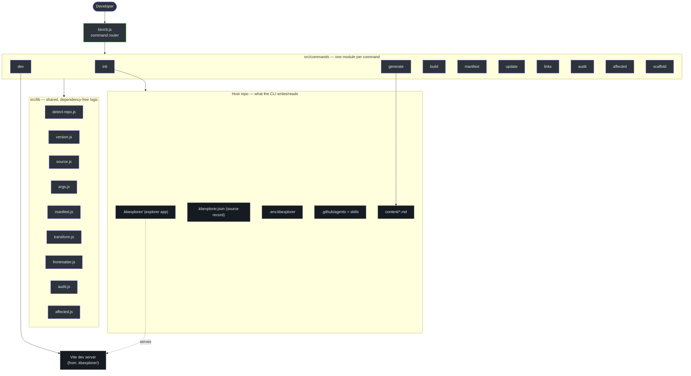

# kbexplorer-cli — Onboarding Hub

**kbexplorer-cli** is a zero-dependency Node.js command-line tool that turns any GitHub
repository into a navigable, interactive **knowledge graph**. It installs a visual
"explorer" web app into a host repo (as a git submodule or a one-time vendored copy),
wires up a set of Copilot agents and skills, and generates a *manifest* of the repo's
issues, pull requests, README, file tree, and hand-authored markdown — which the explorer
renders as an explorable constellation of cards, force-directed networks, and deep-dive
reading views. The CLI itself ships no runtime dependencies: it orchestrates `git`, the
`gh` CLI, and `vite` (from the installed template) using only Node built-ins.

This folder contains three onboarding guides, each written for a different reader. Pick the
one that matches what you're doing — or read several if you wear multiple hats.

## Choose your guide

| Guide | Audience | What you'll learn | Time |
|-------|----------|-------------------|------|
| [Contributor Guide](./contributor-guide.md) | Engineers working on the **CLI codebase** (first PR → deep changes) | Setup, codebase patterns, testing, debugging — plus a full **Architecture & internals** part: the core design insight, decision log, failure modes, security, tech debt | ~45 min |
| [Knowledge Base Author Guide](./author-guide.md) | People **using** the tool to build a KB over a repo or content store | Content modes, authoring nodes, AI-assisted generation, themes, preview/build/publish, health checks, updates | ~30 min |
| [Platform & Template Author Guide](./platform-guide.md) | Teams **standardizing kbexplorer across an org** | Install modes, custom templates + the template contract, the source record, fleet-wide updates, cross-repo reuse, roadmap | ~30 min |

## What this project is, in one minute

- **Type:** A CLI distributed on npm as [`@anokye-labs/kbexplorer`](https://github.com/anokye-labs/kbexplorer-cli/blob/main/package.json#L2), run via `npx kbexplorer <command>`.
- **Language/runtime:** JavaScript (ES modules), Node.js **≥ 22** — see [`package.json:26-28`](https://github.com/anokye-labs/kbexplorer-cli/blob/main/package.json#L26-L28).
- **Dependencies:** **None at runtime.** The CLI shells out to `git`, `gh`, and `vite`. This keeps `npx` cold-starts fast and the supply chain tiny.
- **Two halves:** this repo is the **CLI** (the installer/orchestrator). The visual app it installs lives in a separate repo, [`anokye-labs/kbexplorer-template`](https://github.com/anokye-labs/kbexplorer-cli/blob/main/src/lib/version.js#L12).
- **Ten commands:** `init`, `generate`, `dev`, `build`, `manifest`, `update`, `links`, `audit`, `affected`, `scaffold` — routed by [`bin/cli.js:22-33`](https://github.com/anokye-labs/kbexplorer-cli/blob/main/bin/cli.js#L22-L33).

## The 10,000-foot picture

<!-- Sources: bin/cli.js:22-30, src/commands/*, src/lib/*, src/commands/init.js:58-149, src/commands/dev.js:29-38 -->

## Key vocabulary (full glossaries live in each guide)

- **Host repo** — the repository you run `kbexplorer init` in. The CLI installs into it.
- **Template / explorer app** — the Vite web app that renders the graph, installed at `.kbexplorer/`.
- **Self-hosted mode** — running the CLI inside the template repo itself; no submodule needed.
- **Manifest** — a JSON snapshot of repo data (tree, README, issues, PRs, commits, authored content) the explorer reads.
- **Catalogue** — the JSON the `kb-architect` agent produces; transformed into `content/*.md` nodes.
- **Node / cluster / connection** — the graph model: a node is a page, a cluster groups nodes, a connection is an edge.
- **Install mode** — `submodule` (default, pinned git submodule) or `vendor` (one-time copy).
- **Source record** — `.kbexplorer.json`, the CLI-owned record of where the template came from.

## Source & citations

All citations link to the default branch (`main`) of
[`anokye-labs/kbexplorer-cli`](https://github.com/anokye-labs/kbexplorer-cli).
