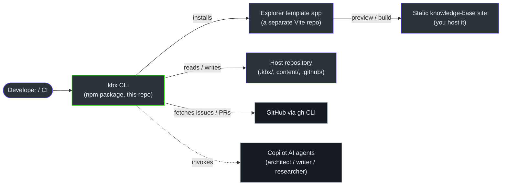
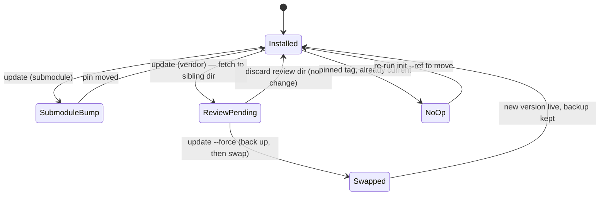
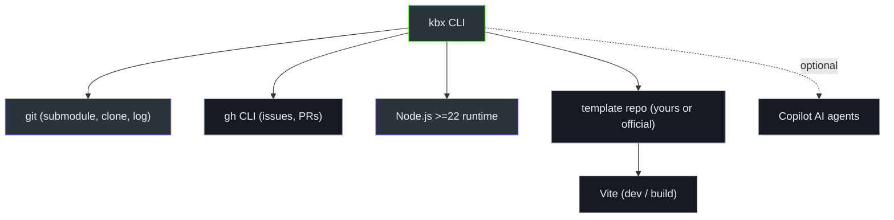
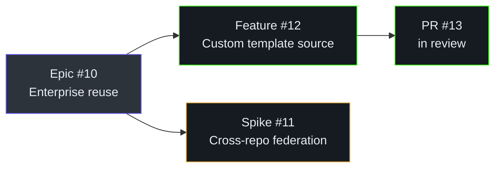

# Platform & Template Author Guide — kbexplorer-cli

**Audience:** the person standardizing kbx **across an organization** — packaging the CLI
and a template so many teams can adopt them, building a custom org-internal template (a different
look and feel), and deciding how installs are pinned, updated, and reused at scale. You operate
the tool fleet-wide rather than author a single knowledge base (for that, see the
[Knowledge Base Author Guide](./author-guide.md)) and you don't necessarily modify the CLI's code
(for that, see the [Contributor Guide](./contributor-guide.md)).

This guide is operational and decision-oriented. It contains only the small amount of code detail
you need to design a rollout; every claim links to source on `main`.

---

## 1. Why this guide exists

The strategic intent behind the recent CLI work is **enterprise reuse**: a shareable CLI plus a
shareable template that any team in an organization can adopt, then customize to their own brand
([Epic #10](https://github.com/anokye-labs/kbexplorer-cli/issues/10)). Two questions follow from
that, and this guide answers both:

1. **How do I give teams a different look and feel?** → a *custom template* (`--template`), used
   either as a tracked submodule or a one-time editable copy (`--vendor`).
2. **How do many repos reuse the same knowledge system?** → today, each repo is its own island;
   cross-repo **federation** (layering private nodes on a shared graph) is an open spike
   ([Spike #11](https://github.com/anokye-labs/kbexplorer-cli/issues/11)). See [§8](#8-cross-repo-reuse--federation-the-open-frontier).

---

## 2. The three deployment units

There is no server, database, or hosted service. The whole system is three small pieces:



<!-- Sources: src/commands/init.js, src/lib/version.js:12, src/lib/manifest.js:181-247, src/assets/agents/* -->

**One npm package** (the CLI), **one template repo** (the web app), and **the host repo**. That's
the entire surface to govern. Operational cost and attack surface are near zero: there's nothing
to keep running, and the CLI ships **zero runtime dependencies**
([`package.json`](https://github.com/anokye-labs/kbexplorer-cli/blob/main/package.json) has no `dependencies` block).

---

## 3. Install modes: submodule vs vendor

`init` installs the template one of two ways. This is the first decision you standardize for your
org, because it determines how teams receive updates and whether they can customize freely.

| | **Submodule** (default) | **Vendor** (one-time copy) |
|---|---|---|
| Flag | _(none)_ | `--vendor` / `--no-submodule` |
| What `.kbx/` is | A pinned git submodule | A plain folder (the template's `.git` is stripped) |
| Best for | Tracking the upstream template **as-is** | **Copy-and-customize** — teams that fork the look & feel |
| Updates | `kbx update` bumps the pin | Opt-in; `update` never clobbers local edits |
| Customizing in place | Discouraged (it's upstream's code) | Expected — the files are yours |

<!-- Sources: src/commands/init.js:89-149, README.md:51-72 -->

```bash
# Default: pinned submodule of the official template
npx kbx init

# One-time editable copy instead of a submodule
npx kbx init --vendor

# Pin to a tag, or track a branch (default: latest release tag)
npx kbx init --ref v1.2.0
npx kbx init --vendor --ref main
```

Two safety properties are deliberate and worth knowing as an operator:

- **A vendored copy never contains a `.git` dir** — `installVendor` clones into a sibling temp
  dir, strips `.git`, validates it has a `package.json`, then atomically `renameSync`s it into
  place, so a failed clone never leaves a half-installed `.kbx/`
  ([`init.js:125-148`](https://github.com/anokye-labs/kbexplorer-cli/blob/main/src/commands/init.js#L125-L148)).
- **Re-running `init` never silently converts modes.** If `.kbx/` already exists with a
  different mode, the CLI warns and refuses — you must remove it first
  ([`init.js:211-221`](https://github.com/anokye-labs/kbexplorer-cli/blob/main/src/commands/init.js#L211-L221)).

For a vendored install you also choose whether to **commit** `.kbx/` (to version your
customizations) or **gitignore** it (to treat it as a re-fetchable dependency) — `init` prints
this guidance ([`init.js:301-306`](https://github.com/anokye-labs/kbexplorer-cli/blob/main/src/commands/init.js#L301-L306)).

---

## 4. Custom templates: your org's look & feel

By default `init` installs the official `anokye-labs/kbexplorer-template`. Point it at your own
fork or an org-internal template with `--template`
([`README.md:42-49`](https://github.com/anokye-labs/kbexplorer-cli/blob/main/README.md#L42-L49)):

```bash
npx kbx init --template https://github.com/my-org/kb-template.git
npx kbx init --template https://github.com/my-org/kb-template.git --vendor --ref main
```

The default URL is only a fallback constant
([`version.js:12`](https://github.com/anokye-labs/kbexplorer-cli/blob/main/src/lib/version.js#L12)); `--template` overrides it and the choice is recorded
in `.kbx.json` (see [§5](#5-the-source-record-kbexplorerjson)). To create an org template,
the simplest path is to **fork the official template** and rebrand it.

### The template contract

A custom template is a normal repo, but the CLI expects a few things from it. Honor this contract
and any commands "just work":

| Requirement | Why | Enforced / used by |
|-------------|-----|--------------------|
| A `package.json` at the root | Validated on install; also how `getAppRoot` recognizes an install | [`init.js:142-144`](https://github.com/anokye-labs/kbexplorer-cli/blob/main/src/commands/init.js#L142-L144), [`detect-repo.js:109-114`](https://github.com/anokye-labs/kbexplorer-cli/blob/main/src/lib/detect-repo.js#L109-L114) |
| A **Vite** app | `dev` and `build` run `npx vite` inside it | [`dev.js:29-38`](https://github.com/anokye-labs/kbexplorer-cli/blob/main/src/commands/dev.js#L29-L38), [`build.js:39-52`](https://github.com/anokye-labs/kbexplorer-cli/blob/main/src/commands/build.js#L39-L52) |
| A `scripts/generate-manifest.js` | `build` runs it to produce the data the UI reads | [`build.js:25-30`](https://github.com/anokye-labs/kbexplorer-cli/blob/main/src/commands/build.js#L25-L30) |
| Reads `VITE_KB_*` env vars | How the CLI passes owner/repo/branch/title/path and local-mode flags | [`init.js:252-258`](https://github.com/anokye-labs/kbexplorer-cli/blob/main/src/commands/init.js#L252-L258), [`dev.js:33-37`](https://github.com/anokye-labs/kbexplorer-cli/blob/main/src/commands/dev.js#L33-L37) |

The env-var interface the CLI hands the template at runtime:

| Variable | Set by | Meaning |
|----------|--------|---------|
| `VITE_KB_OWNER` / `VITE_KB_REPO` / `VITE_KB_BRANCH` / `VITE_KB_TITLE` / `VITE_KB_PATH` | `init` → `.env.kbx` | Which repo the graph describes, its title, and the authored-content path |
| `VITE_KB_LOCAL` | `dev` / `build` | Tells the app it's running locally |
| `VITE_ENV_DIR` | `dev` / `build` | Where to find `.env.kbx` and generated data |
| `VITE_BASE_PATH` | `build --base` | Sub-path for hosting under a prefix |

<!-- Sources: src/commands/init.js:252-261, src/commands/dev.js:33-37, src/commands/build.js:46-51 -->

As long as your fork keeps that contract, you can change everything else — components, styling,
visual modes, themes, branding — and every team that installs `--template <your-fork>` gets your
look and feel.

### Customizing a template

The workflow for building and iterating on a custom template:

1. **Fork the official template** into your org (e.g. `my-org/kb-template`) and clone it.
2. **Edit freely.** Everything that isn't part of [the contract](#the-template-contract) is yours
   to change — UI components, CSS/styling, fonts, the default theme and visual modes, logos and
   branding, and the template's own default config.
3. **Preview your changes two ways:**
   - **Self-hosted (fastest loop):** run `npx kbx dev` *inside the template repo itself*.
     Because the template's `package.json` name is `kbx`/`kbexplorer-template`, the CLI
     recognizes the repo as its own app root and runs Vite against it directly — no install step
     ([`detect-repo.js:45-52`](https://github.com/anokye-labs/kbexplorer-cli/blob/main/src/lib/detect-repo.js#L45-L52), [`:109-114`](https://github.com/anokye-labs/kbexplorer-cli/blob/main/src/lib/detect-repo.js#L109-L114)).
   - **Real-install check:** in a throwaway host repo, run
     `npx kbx init --template <fork-url> --ref <branch> --vendor` and then `kbx dev`
     to see exactly what a team will get.
4. **Cut a release.** Tag with semver so installs that track releases pick it up:

   ```bash
   git tag v1.1.0 && git push origin v1.1.0
   ```

   A no-`--ref` (`release`) install resolves the **latest tag**; a `--ref main` install tracks that
   branch's HEAD; a `--ref v1.1.0` install pins to that exact tag
   ([`source.js:32-35`](https://github.com/anokye-labs/kbexplorer-cli/blob/main/src/lib/source.js#L32-L35)).

> **Don't break the contract.** Keep the root `package.json` (and its `kbx`/
> `kbexplorer-template` name for self-hosted preview), stay a Vite app, keep
> `scripts/generate-manifest.js`, and keep consuming the `VITE_KB_*` env vars. Everything else is
> fair game.

---

## 5. The source record: `.kbx.json`

Both install modes write a small record at the host repo root. **This file, not the CLI binary,
is the source of truth** for where a team's template came from and how to update it
([`source.js:1-63`](https://github.com/anokye-labs/kbexplorer-cli/blob/main/src/lib/source.js#L1-L63)):

```json
{
  "template": "https://github.com/my-org/kb-template.git",
  "ref": "v1.2.0",
  "refType": "tag",
  "resolvedCommit": "a1b2c3d…",
  "mode": "submodule"
}
```

| Field | What it captures |
|-------|------------------|
| `template` | The template URL this repo was installed from |
| `ref` | The tag or branch requested (`--ref`) |
| `refType` | `release` (no ref → latest tag), `tag` (semver), or `branch` — derived by `classifyRef` ([`source.js:32-35`](https://github.com/anokye-labs/kbexplorer-cli/blob/main/src/lib/source.js#L32-L35)) |
| `resolvedCommit` | The exact SHA installed — for reproducibility and "already up to date" checks |
| `mode` | `submodule` or `vendor` |

Because the record stores a **resolved commit**, `update` can tell whether a repo is already
current by SHA rather than guessing from a mutable ref
([`update.js:228-232`](https://github.com/anokye-labs/kbexplorer-cli/blob/main/src/commands/update.js#L228-L232)). For governance, you can audit which template
and version each repo in your fleet is on simply by reading its `.kbx.json`.

---

## 6. Updating across a fleet

`kbx update` reads the source record and updates per mode — and the **never-clobber**
behavior is the property that makes org-wide rollouts safe
([`update.js:218-265`](https://github.com/anokye-labs/kbexplorer-cli/blob/main/src/commands/update.js#L218-L265)):



<!-- Sources: src/commands/update.js:79-265, src/lib/source.js:32-35 -->

- **Submodule installs** update by bumping the pin to the recorded ref/branch.
- **Vendor installs** are protected: `update` fetches the new version into a *sibling* folder for
  review and will not overwrite a customized copy. Only `--force` swaps it in, and even then it
  **backs up the current copy first** ([`update.js:243-265`](https://github.com/anokye-labs/kbexplorer-cli/blob/main/src/commands/update.js#L243-L265)).
- A repo **pinned to a tag** that's already current is a no-op; move it by re-running
  `init --ref <new>`.

### Updating when you're on a custom template

This is the key property for org reuse: **`update` updates from your custom template, not the
official one.** It reads the recorded `template` URL from `.kbx.json` and pulls from there —
the hardcoded default is never consulted for an existing install
([`update.js:68-83`](https://github.com/anokye-labs/kbexplorer-cli/blob/main/src/commands/update.js#L68-L83), [`:93`](https://github.com/anokye-labs/kbexplorer-cli/blob/main/src/commands/update.js#L93), [`:194`](https://github.com/anokye-labs/kbexplorer-cli/blob/main/src/commands/update.js#L194)). What `update` does then depends on how the team
pinned it:

| Install was… | `kbx update` does | Source |
|--------------|--------------------------|--------|
| `release` (no `--ref`) | Fetches your template's **latest release tag**, shows the changelog, prompts to confirm (or `--force`) | [`update.js:135-185`](https://github.com/anokye-labs/kbexplorer-cli/blob/main/src/commands/update.js#L135-L185) |
| `--ref <branch>` | Pulls the latest commit of that branch (prompts, or `--force`) | [`update.js:115-133`](https://github.com/anokye-labs/kbexplorer-cli/blob/main/src/commands/update.js#L115-L133) |
| `--ref <tag>` (pinned) | Nothing — reports the pin; move with `init --ref <new>` | [`update.js:110-113`](https://github.com/anokye-labs/kbexplorer-cli/blob/main/src/commands/update.js#L110-L113) |

For a **submodule** install, if `.gitmodules` ever disagrees with `.kbx.json` (e.g. someone
re-pointed the submodule by hand), `update` warns and trusts the source record — reconcile the two
so you don't update from the wrong remote
([`update.js:97-101`](https://github.com/anokye-labs/kbexplorer-cli/blob/main/src/commands/update.js#L97-L101)).

For a **vendored** custom template that a team has hand-edited, the never-clobber flow is the whole
point — review then apply, explicitly:

```bash
# 1. Fetch the new template version into a sibling review folder (no changes made yet)
npx kbx update
#    → prints:  git diff --no-index .kbx .kbx-update-<timestamp>

# 2. Inspect what would change against your customized copy
git diff --no-index .kbx ".kbx-update-<timestamp>"

# 3. Apply it — backs up your current .kbx/ then swaps the new one in
npx kbx update --force
```

The backup is written to `.kbx.backup-<timestamp>/`, so a team that customized a vendored
template can always recover its edits after an update
([`update.js:234-265`](https://github.com/anokye-labs/kbexplorer-cli/blob/main/src/commands/update.js#L234-L265)). Re-applying those edits on top of the new version is a manual
merge — which is the trade-off vendor mode makes in exchange for full ownership.

> **Note:** `update` also always refreshes the agents and skills in `.github/`, because those ship
> with the CLI package rather than the template ([`update.js:59-65`](https://github.com/anokye-labs/kbexplorer-cli/blob/main/src/commands/update.js#L59-L65)).

**Rollout pattern:** tag releases of your org template (`v1.0.0`, `v1.1.0`…). Teams that want
stability install pinned (`--ref v1.0.0`) and move deliberately; teams that want the latest track
a branch (`--ref main`). `update` then does the right thing per repo with no central coordination.

---

## 7. Standardizing kbx across the org

A practical recipe for putting the CLI + template inside an enterprise org for reuse:

1. **Publish/mirror the CLI** so teams can `npx` it (the package is published via OIDC trusted
   publishing — no long-lived npm tokens ([`publish.yml:7-9`](https://github.com/anokye-labs/kbexplorer-cli/blob/main/.github/workflows/publish.yml#L7-L9))).
2. **Fork the template** into your org and rebrand it, keeping the [template contract](#the-template-contract). Tag releases.
3. **Pick a default mode for your org:**
   - *Submodule + pinned tag* — most teams, want upstream as-is with controlled updates.
   - *Vendor* — teams that need to diverge and customize the template itself.
4. **Document one install command** for your teams, e.g.
   `npx kbx init --template https://github.com/my-org/kb-template.git --ref v1.0.0`.
5. **Audit** adoption and versions by reading each repo's `.kbx.json`.

| Decision | Choose… | Because |
|----------|---------|---------|
| Most teams, central control | Submodule + `--ref <tag>` | Cheap updates, clean separation, deliberate version moves |
| A team that rebrands heavily | Vendor (committed) | Full ownership of the template files; updates stay opt-in |
| A throwaway / experimental repo | Vendor (gitignored) | Treat the template as a re-fetchable dependency |

---

## 8. Cross-repo reuse & federation (the open frontier)

The most-requested enterprise capability — **a personal or team repo that layers its own private
nodes on top of another repo's shared knowledge graph** — is *not solved yet*. Today each repo
produces its own self-contained graph; there is no built-in way to point one repo's explorer at
another repo's nodes. This is tracked as an open investigation
([Spike #11](https://github.com/anokye-labs/kbexplorer-cli/issues/11)).

Two directions are on the table, and the spike should decide between them before any broad
rollout depends on it:

| Approach | How it would work | Trade-off |
|----------|-------------------|-----------|
| **Fork** | Copy the source repo's KB into your space and add your nodes | Simple, works today manually; drifts from upstream over time |
| **Pointer / federation** | Your repo references another's graph and overlays private nodes | No duplication, stays current — but needs new resolution + merge logic that doesn't exist yet |

Until federation lands, the workable interim is: use **authored mode** to hand-curate the shared
pages you care about, or **fork** the upstream content and layer your own nodes on top. If
cross-repo reuse is core to your rollout, prioritize the spike first — it's the make-or-break
capability for the "layer private nodes on a shared graph" use case.

---

## 9. Dependencies & operational risk



<!-- Sources: src/lib/manifest.js:168-275, src/commands/init.js:100-135, src/commands/dev.js:29-38 -->

| Dependency | Type | Risk if unavailable | Operator action |
|------------|------|---------------------|-----------------|
| `git` | Platform tool | High — install/update can't proceed | Ensure on dev/CI images |
| Node.js ≥22 | Platform | High — nothing runs | Standardize the runtime |
| Template repo | Git remote | High for `init`; cached locally after install | Mirror it internally for availability |
| `gh` CLI | Service tool | Low — issues/PRs skipped, build still works | Provide auth where you want issue/PR data |
| Vite | Library (in template) | Medium — affects preview/build only | Owned by the template |
| Copilot agents | Service | Low — only content generation depends on them | Optional |

The two residual risks that are organizational rather than code defects: **bus factor** (a small
team owning both the CLI and the template) and **AI output quality** (agent-assisted, always
human-reviewed). The codebase has actively reduced its other risks — zero supply-chain deps,
non-clobbering updates, and decoupling host repos from the default template URL via
`.kbx.json` ([Feature #12](https://github.com/anokye-labs/kbexplorer-cli/issues/12)).

---

## 10. Roadmap

| Workstream | Goal | Status |
|------------|------|--------|
| Custom template source (`--template`, vendor) | Let teams fork the look & feel | Shipped in review ([PR #13](https://github.com/anokye-labs/kbexplorer-cli/pull/13), closes [#12](https://github.com/anokye-labs/kbexplorer-cli/issues/12)) |
| Cross-repo node federation | Reuse one repo's graph from another; layer private nodes | Planned spike ([#11](https://github.com/anokye-labs/kbexplorer-cli/issues/11)) |
| Enterprise reuse | Shareable CLI + template across an org | Epic open ([#10](https://github.com/anokye-labs/kbexplorer-cli/issues/10)) |
| Content-generation maturity | Reduce manual effort to produce docs | Beta, agent-assisted |



<!-- Sources: github issues #10, #11, #12; PR #13 -->

Work is organized issue-first: every change traces to a typed GitHub issue (Epic →
Feature/Task) and a PR that references it — enforced in CI
([`linked-issue.yml`](https://github.com/anokye-labs/kbexplorer-cli/blob/main/.github/workflows/linked-issue.yml)).

---

## 11. Recommendations for an org rollout

1. **Decide fork-vs-pointer for federation early** ([#11](https://github.com/anokye-labs/kbexplorer-cli/issues/11)). Cross-repo node reuse is the make-or-break capability for "personal repo layering on shared nodes"; don't commit to broad rollout before it's settled.
2. **Mirror the CLI and the template internally** so installs don't depend on external availability, and pin teams to tagged releases.
3. **Standardize on submodule + pinned tags for most teams**, reserving vendor mode for teams that genuinely need to customize the template.
4. **Pilot with one internal team** using `--template` + your chosen mode, and capture friction before broad rollout.
5. **Reduce bus-factor risk** by documenting your forked template to the same standard as this onboarding set and naming a second maintainer.

